# Creating a Panorama Application

<!-- toc -->

*If you come across any mistakes or bugs in this tutorial, please let us know using a Github issue, a post on the DJI forum, or commenting in the Gitbook. Please feel free to send us Github pull request and help us fix any issues. However, all pull requests related to document must follow the [document style](https://github.com/dji-sdk/Mobile-SDK-Tutorial/issues/19)*

*Note: For the DJI Inspire 1 and the Phantom 3 Professional, using the DJI SDK and OpenCV Lib*

---

In this tutorial, you will learn how to build a cool panorama app. With the help of the powerful DJI SDK and OpenCV libraries, this is actually quite easy. You will be using Intelligent Navigation's Waypoint feature and Joystick to rotate the aircraft to take photos. Let's get started!

You can download the demo project from this **Github Page**. If you want to have a better reading experience, please check our [Gitbook Version](http://dji-dev.gitbooks.io/mobile-sdk-tutorials/content/en/Android/PanoDemo/PanoDemo_en.html)

## Setting up and Running the PanoDemo App

### Setting up your Development Environment

There are 8 separate required downloads to set up our development environment. Follow each link to download and install each package. The information in brackets next to each link details the version that we have used in creating our demo:

 1. [Java Devlopment Kit](http://www.ntu.edu.sg/home/ehchua/programming/howto/JDK_Howto.html) (jdk 8u45)
 2. [Eclipse](http://www.eclipse.org/downloads/) (Eclipse Mars) 
 3. [Eclipse Android Development Tools](http://developer.android.com/sdk/installing/installing-adt.html) (ADT 23.0.6) 
 4. [Android Native Development Kit](http://developer.android.com/ndk/guides/setup.html) (ndk r10e) 
 5. [Eclipse C/C++ Development Tooling](http://eclipse.org/cdt/) (cdt8.7.0)  Follow the "Installing and running the CDT" segment of this tutorial for further guidance: http://www.ibm.com/developerworks/opensource/library/os-ecc/?S_TACT=105AGX44&S_CMP=ART
 6. [Cygwin](http://www.cygwin.com) (cygwin2.1.0)Follow the "Installing Cygwin" segment of this tutorial for further guidance: http://mindtherobot.com/blog/452/android-beginners-ndk-setup-step-by-step/
 7. [OpenCV](http://opencv.org) (OpenCV2.4.11) Make sure to download "OpenCV for Android"
 8. [DJI Software Development Kit](http://dev.dji.com) (DJI SDK 2.3.0)

### Importing the Demo Project into Eclipse

We've already gone ahead and created a working panorama app for you to reference while you work through this tutorial. You can go ahead and download the package here:

<https://github.com/DJI-Mobile-SDK/Android-PanoramaDemo.git>

1.Open Eclipse->File->Import->General->Existing Projects into Workspace->Select root directory->Browse. Locate the downloaded folder "PanoDemo":

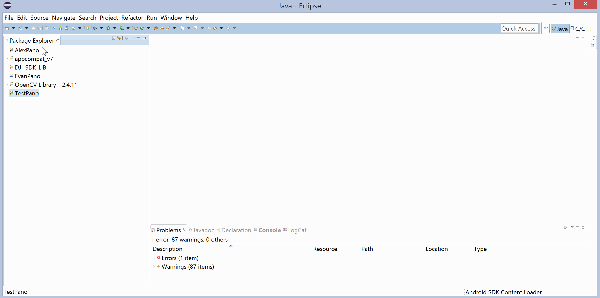

2.Select the following 3 projects:

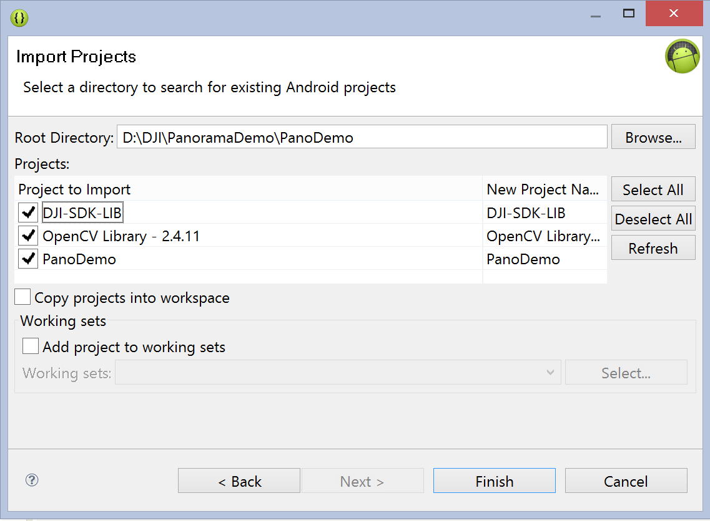

3.Press Finish and wait for the project to build. In the Package Explorer on the left, right click on the "PanoDemo" package -> Properties -> Android. Check that under the "Libraries" section "OpenCV Library" and "DJI-SDK-LIB" have both been added. If not, press "Add..." to add them:

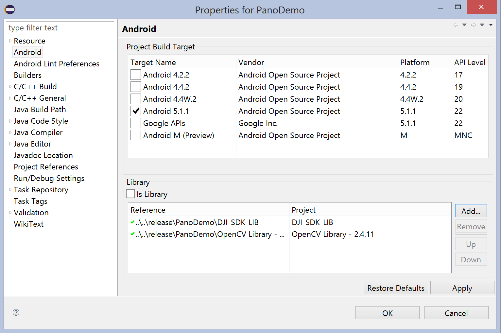

4.Navigate to the "Android.mk" file in the "PanoDemo" package. Update the highlighted line so that it includes the path of your own Android OpenCV package.

5.Ensure that the following folders have been added to your System Path. Some of them should have already been added in the process of following the tutorials linked in part 1.

 - C:\Program Files\Java\jdk1.8.0_45\bin;
 - D:\DJI\PanoramaDemo\release\NDK\android-ndk-r10e;
 - D:\DJI\PanoramaDemo\release\NDK\android-ndk-r10e\build;
 - D:\DJI\PanoramaDemo\release\NDK\android-ndk-r10e\prebuilt\windows-x86_64\bin
 - C:\OpenCV-2.4.11-android-sdk\OpenCV-android-sdk\sdk\native\jni;

### Using the PanoDemo App

Run the "PanoDemo" project on an Android device (for instructions on how to do this [click here](http://developer.android.com/tools/building/building-eclipse.html)) Once the project is installed on your device, connect it to a DJI remote controller via a USB cable, turn on the remote and its associated DJI drone, and start up the newly installed "PanoDemo" app.

--

When the app first starts up, you will be greeted with this page. Press the "Start" button to begin taking a panorama. If the "Start" button is grayed out, try unplugging and plugging your device back into the remote, and ensure that it is properly connected.

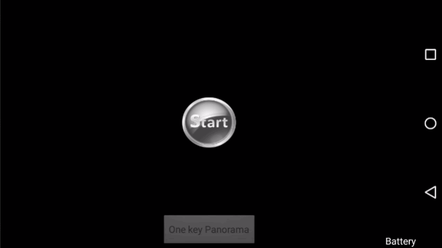

After pressing "Start", a live video feed from the drone will be displayed.
Position your drone somewhere it can nice a nice photo, and press the "One key Panorama" button to start the automated panorama capturing process.

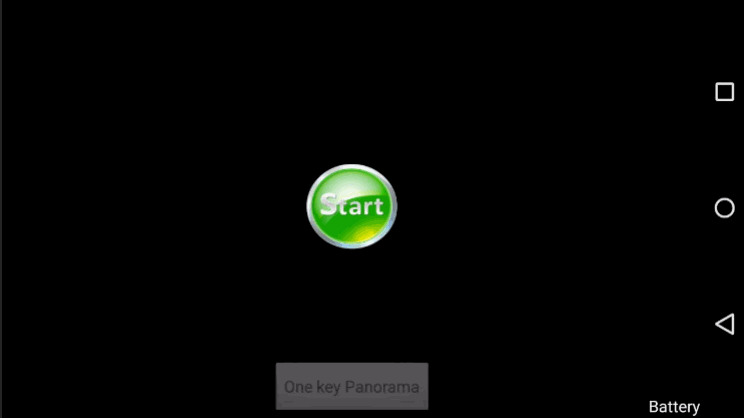

If you are connected to a Phantom 3 Professional, you will be greeted with an alert box like the one shown below. Choose either option to continue. You will learn what the difference between the two is later on in this tutorial.
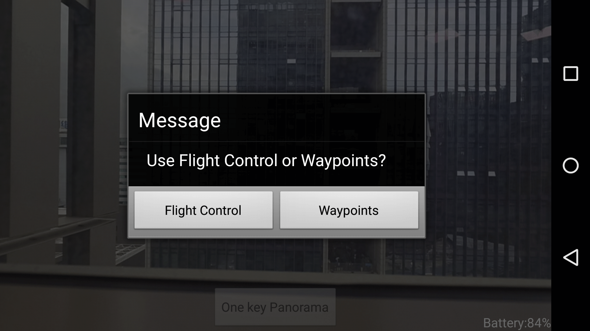

The drone will start to take photos, either by rotating the gimbal (if you are using the Inspire 1), or by rotating the entire drone (if you are using the Phantom 3 Professional).

After the drone captures 8 images, each captured at a 45 degree angle differential from the last, you will be prompted to allow the app to stitch the photos together. Press "OK" to continue. 

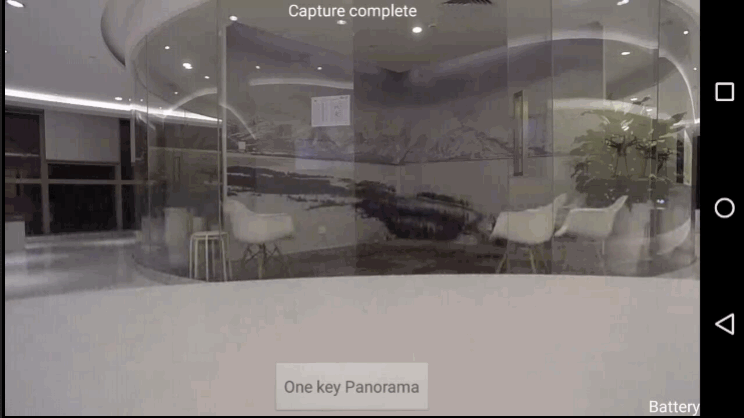

The app will display the photos onboard the drone's SD card, and automatically select the 8 it had just taken and download them. No user input is required.

The drone will then stitch the photos together. Video preview will be disabled during this period, and will instead display a static image. Please note that the stitching process will take several minutes to complete.

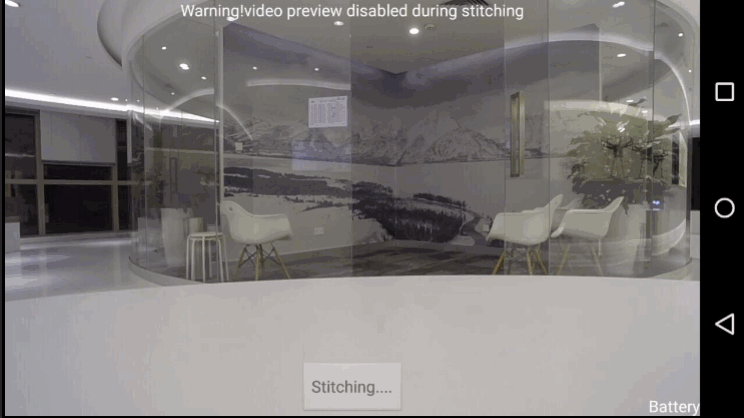

Once the photos have been stitched together, you will receive a dialogue box allowing you to view the finished result!

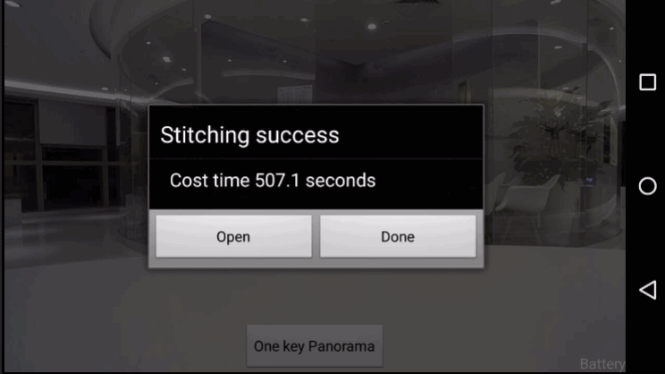

## Creating your own Panorama App

Now that you've played around with the finished product, you can now have a go at creating your own app!

The demo app you just ran may seem intimidating to code yourself, but it can be broken down into several simple tasks:

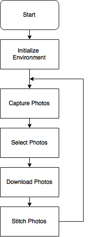

We'll work our way slowly through each part of the above flowchart. Go ahead and create a new Android Application project in the Eclipse. Name your main activity "MainActivity".

You should have already imported the **DJI SDK** and **OpenCV** libraries in the previous section. If you haven't, import them now. The libraries can be found in the demo panorama app package (as shown in the previous section), or can be downloaded in part 1 from the provided links.

Right click on your project and select Properties -> Android. Check that under the "Libraries" section "OpenCV Library" and "DJI-SDK-LIB" have both been added. If not, press "Add..." to add them.

## Creating the User Interface

### App permissions and basic layout

Our app is going to need to use a few permissions in order to function. Let's get these all out of the way in one go. Add the following permissions and features into your **Android Manifest** file:

~~~xml
<uses-permission android:name="android.permission.INTERNET" />
    <uses-permission android:name="android.permission.ACCESS_WIFI_STATE" />
    <uses-permission android:name="android.permission.WAKE_LOCK" />
    <uses-permission android:name="android.permission.ACCESS_COARSE_LOCATION" />
    <uses-permission android:name="android.permission.ACCESS_NETWORK_STATE" />
    <uses-permission android:name="android.permission.ACCESS_FINE_LOCATION" />
    <uses-permission android:name="android.permission.CHANGE_WIFI_STATE" />
    <uses-permission android:name="android.permission.MOUNT_UNMOUNT_FILESYSTEMS" />
    <uses-permission android:name="android.permission.WRITE_EXTERNAL_STORAGE" />
    <uses-permission android:name="android.permission.READ_EXTERNAL_STORAGE" />
    <uses-permission android:name="android.permission.READ_PHONE_STATE" />
    <uses-permission android:name="android.permission.RECORD_AUDIO" />
    <uses-permission android:name="android.permission.MODIFY_AUDIO_SETTINGS" />
    <uses-permission android:name="android.permission.CAMERA" />

    <uses-feature
        android:name="android.hardware.camera"
        android:required="false" />
    <uses-feature
        android:name="android.hardware.camera.autofocus"
        android:required="false" />
    <uses-feature
        android:name="android.hardware.camera.front"
        android:required="false" />
    <uses-feature
        android:name="android.hardware.camera.front.autofocus"
        android:required="false" />
    <uses-feature
        android:name="android.hardware.usb.accessory"
        android:required="false" />
    <uses-feature
        android:name="android.hardware.usb.host"
        android:required="false" />
~~~

The important permissions here allow us to connect via USB to the DJI remote controller, as well as write and read to and from external storage.

In the same **AndroidManifest.xml** file, alter your **<application** **... >** section to look something like this:

~~~xml
<application
	// These 3 lines should have been automatically generated
    android:allowBackup="true"
    android:icon="@drawable/ic_launcher"
    android:label="@string/app_name"

	// This one too, but we're deleting it
	// android:theme="@style/AppTheme"

 	// Add these 2 lines
    android:theme="@android:style/Theme.NoTitleBar.Fullscreen" 
    android:hardwareAccelerated="true">

	// Note that this line comes right after the opening tag, not inside of it
	<uses-library android:name="com.android.future.usb.accessory" />
~~~

The three lines we added remove the title bar from the layout, allow hardware acceleration, and allow us to connect via usb to the DJI remote controller respectively. Hardware acceleration will allow our app to use the GPU to help with processing intensive parts.

Within your **MainActivity** **<activity** **... >** section, add the following code:

~~~xml
<activity
	android:name=".MainActivity"
	android:label="@string/app_name"

	...

	// Add this line
	android:screenOrientation="landscape" >

	...

	// Add these lines
	<intent-filter>
		<action android:name="android.hardware.usb.action.USB_ACCESSORY_ATTACHED" />
	</intent-filter>

	<meta-data
		android:name="android.hardware.usb.action.USB_ACCESSORY_ATTACHED"
		android:resource="@xml/accessory_filter" />

~~~

The first line added locks the app into a landscape orientation. The intent filter and meta data allow the app to start itself up when your device connects
via USB to an external device.

Change your **MainActivity** (or your main activity) class so that it extends **Activity**.

Lastly, we're going to want our device's screen to stay on while our app goes through its automated process of creating a panorama. Add the following line of code to your **onCreate()** method to keep your device awake.

~~~java
@Override
protected void onCreate(Bundle savedInstanceState)
{
    super.onCreate(savedInstanceState);

	// Keep screen on
    getWindow().addFlags(WindowManager.LayoutParams.FLAG_KEEP_SCREEN_ON);

    setContentView(R.layout.activity_main);
}
~~~

Run your app. It doesn't contain anything right now, but you will notice that it starts up in landscape mode, and does not contain a title bar!

### Creating the User Interface

Our app will consist of several view elements:
 - **mDjiGLSurfaceView** - A DjiGLSurfaceView view, which is a widget provided by the DJI mobile SDK. It acts as a specialized SurfaceView view that displays live video feed from the Drone's camera.
 - **commonMessageTextView** - The TextView element at the top of the app, used to display information on the app's current status.
 - **startButton** - The button used to start up the video feed.
 - **stitchingButton** - The button at the bottom of the app. Used to start the photo capture and stitching process.

There also exists a **batteryTextView**, but as this is not very relevant to the app's purpose, we'll be leaving this out for now. Stay tuned till the end of the tutorial for a bonus segment on how to add it though!

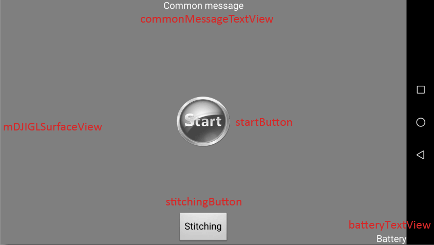

Add these elements to your **activity_main.xml** file. Here's our xml code as reference. All of this is contained within a relative layout:

~~~xml
<dji.sdk.widget.DjiGLSurfaceView
    android:id="@+id/mDjiSurfaceView"
    android:layout_width="match_parent"
    android:layout_height="match_parent" />

<LinearLayout
    android:id="@+id/centerLinearLayout"
    android:layout_width="wrap_content"
    android:layout_height="wrap_content"
    android:layout_centerHorizontal="true"
    android:layout_centerVertical="true"
    android:orientation="vertical" >

    <Button
        android:id="@+id/startButton"
        android:layout_width="80dp"
        android:layout_height="75dp"
        android:layout_gravity="center_horizontal"
        android:background="@drawable/start_gray" />
</LinearLayout>

<TextView
    android:id="@+id/commonMessageTextView"
    android:layout_width="wrap_content"
    android:layout_height="wrap_content"
    android:layout_alignParentTop="true"
    android:layout_centerHorizontal="true"
    android:gravity="center_horizontal"
    android:text="@string/commonMessageString"
    android:textColor="@android:color/white" />

<Button
    android:id="@+id/stitchingButton"
    android:layout_width="wrap_content"
    android:layout_height="wrap_content"
    android:layout_alignParentBottom="true"
    android:layout_centerHorizontal="true"
    android:text="@string/stitching" />
~~~

In our code we reference a **start_gray** resource. That's the image we use for our startButton. If you'd like your start button to look like ours, find the image files (PanoDemo\PanoDemo\res\drawable-mdpi) and copy them into your own image resource folder. Otherwise, you're going to have to create or find your own image files and copy them into your image resource folder.

You'll also notice that we reference three string values that don't exist for you yet. We're going to be referencing quite a few string resources, and instead of going through the hassle of adding them to our **strings.xml** resource file as we encounter them, let's just add them all right now. Copy the following code into your **strings.xml** file (res/values):

~~~xml
<!-- UI -->
    <string name="dji_sdk_activate_error">DJI SDK activation error</string>
    <string name="stitching">Stitching</string>
    <string name="one_key_panorama">One Button Panorama</string>
    <string name="commonMessageString">Common message</string>
    <string name="groundstation_take_control">Caution! GroundStation taking control now</string>
    <string name="init_gimabal_yaw">Initializing gimbal....</string>
    <string name="test">Test</string>
    <string name="capturing_image">Capturing</string>
    <string name="capture_image_complete">Capture complete</string>
    <string name="downloading">Downloading</string>
    <string name="battery">Battery</string>
    <string name="pressAgainExitString">Press again to exit</string>
    <string name="unsupported_drone">Unsupported drone, use Inspire1 or Phantom 3 pro and try again</string>
    <string name="video_preview_disabled_during_stitching">Warning! Video preview disabled during stitching</string>
~~~

Now that we have a UI ready to use, we have to initialize it. Head into your **onCreate** method and add a line calling **initUIControls()**, which is a method we're about to create. If your coding environment hasn't automatically created an **onCreate** method, add it as shown below:

~~~java
@Override
	protected void onCreate(Bundle savedInstanceState)
	{
		super.onCreate(savedInstanceState);
		getWindow().addFlags(WindowManager.LayoutParams.FLAG_KEEP_SCREEN_ON);
		setContentView(R.layout.activity_main);
		//onCreate init
		initUIControls();
	}
~~~

Now add the following variables to your **MainActivity** class:

~~~java
private DjiGLSurfaceView mDjiGLSurfaceView;
private TextView commonMessageTextView;
private LinearLayout centerLinearLayout;
private Button startButton;
private Button stitchingButton;
private ProgressDialog mDownloadDialog;
~~~

Create a method **initUIControls()** as shown below:

~~~java
private void initUIControls()
{
    //Assign variables to their corresponding views
    mDjiGLSurfaceView=(DjiGLSurfaceView)findViewById(R.id.mDjiSurfaceView);
    commonMessageTextView=(TextView)findViewById(R.id.commonMessageTextView);
    centerLinearLayout=(LinearLayout)findViewById(R.id.centerLinearLayout);
    startButton=(Button)findViewById(R.id.startButton);
    stitchingButton=(Button)findViewById(R.id.stitchingButton);

    //Add Listeners for buttons
    startButton.setOnClickListener(this);
    stitchingButton.setOnClickListener(this);

    //Customize controls
    commonMessageTextView.setText("");
    startButton.setClickable(false);
    stitchingButton.setEnabled(false);
    stitchingButton.setText(getString(R.string.one_key_panorama));
}
~~~

We can split this function into three parts. The first two should look very familiar to you if you have experience with Android Development. We assign the variables we just created to their corresponding view elements defined in the **activity_main.xml** file, then set this class as the onClickListener for our buttons.

In the third part we customize our different view elements so that they appear as we'd like them to when the app just starts up. Our **commonMessageTextView** is set to contain no text, as there is no message we'd like to show the user. We keep both our buttons unclickable (we will enable the start button a bit later on), and set the text of our **stitchingButton**.

We're also going to initialize a download progress dialog box. We'll start and display this progress bar quite a bit later on, when we're downloading images from the drone to our device, but we're going to initialize it now:

~~~java
private void initDownloadProgressDialog()
{
    mDownloadDialog = new ProgressDialog(MainActivity.this);
    mDownloadDialog.setTitle(R.string.downloading);
    mDownloadDialog.setIcon(android.R.drawable.ic_dialog_info);
    mDownloadDialog.setProgressStyle(ProgressDialog.STYLE_HORIZONTAL);
    mDownloadDialog.setCanceledOnTouchOutside(false);
    mDownloadDialog.setCancelable(false);
}
~~~

Call **initDownloadProgressDialog()** at the end of **initUIControls()**:

~~~
private void initUIControls()
{
    ...

	initDownloadProgressDialog();
}
~~~

Lastly, because we're setting onClickListeners, we're going to need to implement OnClickListener:

~~~
public class MainActivity extends ActionBarActivity implements OnClickListener {
...
}
~~~

Build and run your project and give your new fancy UI a look. It doesn't do anything quite yet, but we'll soon fix that.

## Initialization and Setup

### Initializing the Environment

Although we've successfully initialized our UI, there's still more to our app that we have to set up. There are four functions we have to create:

**initStitchingImageDirectory()** will create directories for the source of our panorama, where we'll find the images to stitch together into a panorama, and for the result of our panorama. First add the following variables in the main class. Make sure to replace "APPNAME" with the name of your own app.

~~~java
private final String STITCHING_SOURCE_IMAGES_DIRECTORY = Environment.getExternalStorageDirectory().getPath()+"/APPNAME/";
private final String STITCHING_RESULT_IMAGES_DIRECTORY = Environment.getExternalStorageDirectory().getPath()+"/APPNAME/result/";
~~~

Now create the function **initStitchingImageDirectory()**.

~~~java
private void initStitchingImageDirectory()
{
    //check if directories already exist. If not, create
    File sourceDirectory = new File(STITCHING_SOURCE_IMAGES_DIRECTORY);
    if(!sourceDirectory.exists())
    {
        sourceDirectory.mkdirs();
    }
    File resultDirectory = new File(STITCHING_RESULT_IMAGES_DIRECTORY);
    if(!resultDirectory.exists())
    {
        resultDirectory.mkdirs();
    }
}
~~~

**initStitchingImageDirectory()** will check your devices external storage for a folder named "APPNAME". If one does not exist, it will create said folder. It carries out the same process for the "result" folder, which exists inside "APPNAME".

Our app will store the raw images it takes in the "APPNAME" folder. Once the images are stitched together, the resultant panorama will be saved in the "result" folder.

**initOpenCVLoader()** loads and initializes the OpenCV library from the current application package through the **initDebug()** function. If **initDebug()** fails, we use the OpenCV manager to load the OpenCV library instead.

~~~java
private boolean initOpenCVLoader()
{
    if (!OpenCVLoader.initDebug())
    {
        // Handle initialization error
        showLOG("init buildin OpenCVLoader error,going to use OpenCV Manager");
        OpenCVLoader.initAsync(OpenCVLoader.OPENCV_VERSION_2_4_3, this, mLoaderCallback);
        return false;
    }
    else
    {
        showLOG("init buildin OpenCVLoader success");
        return true;
    }
}
~~~

The above is a pretty standard usage of the OpenCV methods. Learn more at http://opencv.org. We load the OpenCV library because we will be using some of its provided functions to handle the bulk of our panorama construction.

Add the following into your class:

~~~java
private static final String TAG = "APPNAMEMainActivity";  //debug TAG. Edit to suit the name of your own app

private void showLOG(String str)
{
    Log.e(TAG, str);
}

private BaseLoaderCallback mLoaderCallback = new BaseLoaderCallback(this) {
    @Override
    public void onManagerConnected(int status) {
        switch (status) {
            case LoaderCallbackInterface.SUCCESS:
            {
                showLOG("OpenCV Manager loaded successfully");
                break;
            }
            default:
            {
                super.onManagerConnected(status);
                break;
            }
        }
    }
};
~~~
The constant **TAG** is just a string we'll use whenever we call **Log.e()** to help us locate relevant logcat messages. **showLOG** is just a simple helper function to display logcat messages. We implemented these here because **mLoaderCallback**, the callback function we use when trying to initialize OpenCV above, uses **showLOG** to confirm if OpenCV has been successfully loaded.

**initDjiSDK()** takes care of all the necessary setup required to use the DJI mobile SDK in your app, then initiates and connects to the drone.

~~~java
private void initDJISDK()
{
    startDJIAoa();
    activateDJISDK();

    // The SDK initiation for Inspire 1
    DJIDrone.initWithType(this.getApplicationContext(), DJIDroneType.DJIDrone_Inspire1);
    DJIDrone.connectToDrone(); // Connect to the drone
}
~~~

You will notice that this code is made specifically for use with the Inspire 1.  This tutorial also supports the use of the Phantom 3, but for simplicity's sake, we will be coding for the Inspire 1 and making some revisions at the end for those of you using a Phantom 3. In this particular part of the code, however, we will be leaving the drone type as it is, as the Inspire 1 and the Phantom 3 both use the same main controller.

**initDjiSDK()** calls the functions **startDJIAoa()** and **activateDJISDK()**, which we'll define below.

Add the code for **startDJIAoa()**, as well as the boolean **isDJIAoaStarted**.

~~~java
private static boolean isDJIAoaStarted = false;  //DJIAoa

private void startDJIAoa()
{
    if(isDJIAoaStarted)
    {
        //Do nothing
        showLOG("DJIAoa aready started");
    }
    else
    {
        ServiceManager.getInstance();
        UsbAccessoryService.registerAoaReceiver(this);
        isDJIAoaStarted = true;
        showLOG("DJIAoa start success");
    }
    Intent aoaIntent = getIntent();
    if(aoaIntent != null)
    {
        String action = aoaIntent.getAction();
        if(action==UsbManager.ACTION_USB_ACCESSORY_ATTACHED || action == Intent.ACTION_MAIN)
        {
            Intent attachedIntent = new Intent();
            attachedIntent.setAction(DJIUsbAccessoryReceiver.ACTION_USB_ACCESSORY_ATTACHED);
            sendBroadcast(attachedIntent);
        }
    }
}
~~~

The purpose of the boolean is to ensure that we only start up DJIAoa if it isn't already started.

Add **activateDJISDK()**:

~~~java
pprivate void activateDJISDK()
{
    new Thread()
    {
        public void run()
        {
            try
            {
                DJIDrone.checkPermission(getApplicationContext(), new DJIGerneralListener()
                {
                    @Override
                    public void onGetPermissionResult(int result)
                    {
                        //result=0 is success
                        showLOG("DJI SDK onGetPermissionResult = "+result);
                        showLOG("DJI SDK onGetPermissionResultDescription = "+DJIError.getCheckPermissionErrorDescription(result));
                        if(result!=0)
                        {
                            showToast(getString(R.string.dji_sdk_activate_error)+":"+DJIError.getCheckPermissionErrorDescription(result));
                        }
                    }
                });
            }
            catch(Exception e)
            {
                showLOG("activateDJISDK() Exception");
                showToast("activateDJISDK() Exception");
                e.printStackTrace();
            }
        }
    }.start();
}
~~~

The purpose of both of these functions have been explained in our very first tutorial [How to Create a Camera Application](http://dji-dev.gitbooks.io/mobile-sdk-tutorials/content/en/Android/FPVDemo/Part1/FPVDemo_Part1_en.html), and should be familiar to you if you have developed apps to use with DJI drones before. If you have not yet read or worked through this tutorial, we suggest you start there. If you are familiar with these functions, you will know that you will also have to register your app on the dev.dji.com website and add the APP key to your manifest file.

Lastly, add **showToast()**, a small helper function that displays toast messages:

~~~java
private void showToast(String str)
{
    Toast.makeText(this, str, Toast.LENGTH_SHORT).show();
}
~~~

**initDJICamera()** creates a schedule so that **CheckCameraConnectionTask()**, a **TimerTask**, is carried out every 3 seconds:

~~~java
private Timer checkCameraConnectionTimer = new Timer();
private void initDJICamera()
{
    //check camera status every 3 seconds
    checkCameraConnectionTimer.schedule(new CheckCameraConnectionTask(), 1000, 3000);
}
~~~

**CheckCameraConnectionTask** uses **checkCameraConnectState** to check if the app is connected to the drone's camera. If so, the start button turns green and will be enabled. If not, the start button remains gray and disabled. Add **CheckCameraConnectionTask**:

~~~java
class CheckCameraConnectionTask extends TimerTask
{
    @Override
    public void run()
    {
        if(checkCameraConnectState()==true)
        {
            runOnUiThread(new Runnable() {
                public void run() {
                    startButton.setBackgroundResource(R.drawable.start_green);
                    startButton.setClickable(true);
                }
            });
        }
        else
        {
            runOnUiThread(new Runnable() {
                public void run() {
                    startButton.setBackgroundResource(R.drawable.start_gray);
                    startButton.setClickable(false);
                    stitchingButton.setEnabled(false);
                }
            });
        }
    }
}
~~~

**checkCameraConnectState()** uses the mobile SDK function **getCamerConnectIsOk()** to check the connection state. Add the function as shown below: 

~~~java
private boolean checkCameraConnectState(){
    //check connection
    boolean cameraConnectState = DJIDrone.getDjiCamera().getCameraConnectIsOk();
    if(cameraConnectState)
    {
        //showLOG("DJI Camera connect ok");
        return true;
    }
    else
    {
        //showLOG("DJI Camera connect failed");
        return false;
    }
}
~~~

Combined, these functions allow **initDJICamera** to start a schedule which will check, every 3 seconds, if the app has succesfully connected to the camera, and act accordingly. Conversely, if the app loses connection with the drone, it will turn the button gray and disable it.

Call these four functions in your **onCreate()** function, as shown below.

~~~java
@Override
protected void onCreate(Bundle savedInstanceState)
{
    super.onCreate(savedInstanceState);
	// Keep screen on
    getWindow().addFlags(WindowManager.LayoutParams.FLAG_KEEP_SCREEN_ON);
    setContentView(R.layout.activity_main);

    //onCreate init
    initUIControls();
    initStitchingImageDirectory();
    initOpenCVLoader();
    initDJISDK();
    initDJICamera();
}
~~~

Go ahead and run your app. With any luck it'll look something like this:

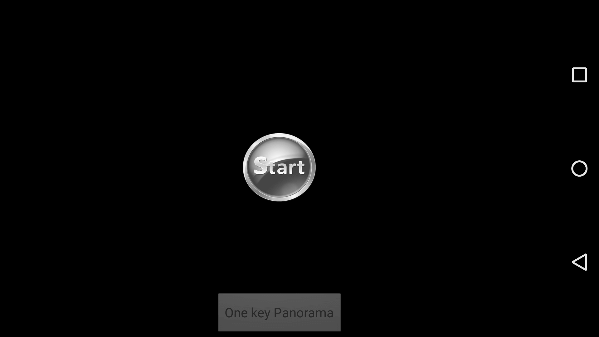

And like this when it detects a connection to a drone's camera:

### Communicating with your drone

At this point you should have an app that handles all the set up required, but leaves the user with start button that doesn't actually do anything. Let's fix that.

We're going to want our **startButton** to start the communication between the drone and our app. Specifically, we're going to want to communicate with the camera and the gimbal. We will do this through a set of callback functions.

Add the following variables to your class:

~~~java
private DJIDroneType mDroneType;

//Callback functions to implement
private DJIReceivedVideoDataCallBack mReceivedVideoDataCallBack;
private DJIGimbalErrorCallBack mGimbalErrorCallBack;
private DJICameraPlayBackStateCallBack mCameraPlayBackStateCallBack;  //to get currently selected pictures count

private DJIGimbalCapacity mDjiGimbalCapacity;
private int numbersOfSelected = 0;  //updated from mCameraPlayBackStateCallBack
private final int COMMON_MESSAGE_DURATION_TIME = 2500;  //in milliseconds
~~~

First, add the following code. This is just to create a helper function **showCommonMessage()** that we will be using quite often in our code. It sets the **commonMessageTextView** element to display a given message, but only for a short period of time as allotted by **COMMON_MESSAGE_DURATION_TIME**.

~~~java
private Timer commonMessageTimer = new Timer();

class commonMessageCleanTask extends TimerTask
{
    @Override
    public void run()
    {
        runOnUiThread(new Runnable()
        {
            public void run()
            {
                commonMessageTextView.setText("");
            }
        });
    }
}

private void showCommonMessage(final String message)
{
    runOnUiThread(new Runnable()
    {           
        @Override
        public void run()
        {
            if(message.equals(commonMessageTextView.getText()))
            {
                //filter same message
                return;
            }
            commonMessageTextView.setText(message);
            commonMessageTimer.schedule(new commonMessageCleanTask(), COMMON_MESSAGE_DURATION_TIME);
        }
    });
}
~~~

Now for the important bit. Create a method **startDJICamera()**:

~~~java
private void startDJICamera() {
    // check drone type
    mDroneType = DJIDrone.getDroneType();

	// start SurfaceView
    mDjiGLSurfaceView.start();

    // decode video data
    mReceivedVideoDataCallBack = new DJIReceivedVideoDataCallBack() {
        @Override
        public void onResult(byte[] videoBuffer, int size) {
            mDjiGLSurfaceView.setDataToDecoder(videoBuffer, size);
        }
    };

    mGimbalErrorCallBack = new DJIGimbalErrorCallBack() {
        @Override
        public void onError(final int error) {
            if (error != DJIError.RESULT_OK) {
                runOnUiThread(new Runnable() {
                    public void run() {
                        showCommonMessage("Gimbal error code=" + error);
                    }
                });
            }
        }
    };

    mCameraPlayBackStateCallBack = new DJICameraPlayBackStateCallBack() {
        @Override
        public void onResult(DJICameraPlaybackState mState) {
            numbersOfSelected = mState.numbersOfSelected;
        }
    };

    DJIDrone.getDjiCamera().setReceivedVideoDataCallBack(
            mReceivedVideoDataCallBack);
    DJIDrone.getDjiGimbal().setGimbalErrorCallBack(mGimbalErrorCallBack);
    DJIDrone.getDjiCamera().setDJICameraPlayBackStateCallBack(
            mCameraPlayBackStateCallBack);

    DJIDrone.getDjiGimbal().startUpdateTimer(1000);
}
~~~

**startDJICamera()** starts by setting **mDroneType** to the type of the drone currently connected to. Next, it starts up the Surface View element. It is crucial that we do this at the beginning of the function, before we set the **ReceivedVideoDataCallBack** function which will send data to the Surface View element. If the Surface View element is not yet started when the callback function is set, the drone will still attempt to send data to it, and the app may crash.

The rest of the function defines four different callback function, sets them, then starts an update timer for the gimbal to call its callback functions. Let's go through each callback function one by one.

**mReceivedVideoDataCallBack** uses **setDataToDecoder()** to send video data from the drone's camera to **mDjiGLSurfaceView** to be decoded and displayed.

**mGimbalErrorCallback** handles situations where the gimbal encounters an error, in which case the int **error** will not equal **DJIError.RESULT_OK**, and an error message should be printed out. This check occurs every second, as specified by **startUpdateTimer(1000)** at the bottom of **startDJICamera()**, which specifies how frequently the gimbal callback functions should be called.

**mCameraPlayBackStateCallBack** updates the **numbersOfSelected** variable, which keeps track of the number of currently selected photos. Users can select photos while in **Multiple Edit** mode, which we'll learn more about later on in this tutorial.

Finally, add to your **onClick()** function so that it calls **startDJICamera** when **startButton** is pressed.

~~~java
@Override
public void onClick(View v) {
    switch (v.getId()) {
        case R.id.startButton:

			// start dji camera
            startDJICamera();

            centerLinearLayout.setVisibility(View.INVISIBLE); // hide startButton
            stitchingButton.setEnabled(true);
            break;
        default:
            break;
    }

}
~~~

## Taking Photos

### Starting the Panorama Procedure

At this point, our app is ready and connected to our drone. The callback functions we implemented allow us to view a live video feed from the drone, get the number of currently selected photos (this will make more sense later on), as well as receive and display gimbal error messages. Now that these capabilities are in place, we can move on to coding the Panorama capturing procedure.

In the previous section we added some code so that pressing **startButton** will call **stitchingButton.setEnabled(true)**. If you recall, **stitchingButton** is the button at the bottom of the app that, when pressed, will start the panorama capturing process. Let's add some functionality to our **onClickListener** to support that. In our **onClick()** method, add the following switch case:

~~~java
case R.id.stitchingButton:
	cleanSourceFolder();
	stitchingButton.setEnabled(false);
	stitchingButton.setText(getString(R.string.one_key_panorama));

	if(mDroneType==DJIDroneType.DJIDrone_Inspire1)
	{
		handler.sendMessage(handler.obtainMessage(HANDLER_INSPIRE1_CAPTURE_IMAGES,""));
	}
	else
	{
		showCommonMessage(getString(R.string.unsupported_drone));
	}
	break;
~~~

The first function we want to call when the user presses **stitchingButton** is **cleanSourceFolder()**, which clears all files (but not folders) out of our source image directory:

~~~java
private void cleanSourceFolder()
{
    File sourceDirectory = new File(STITCHING_SOURCE_IMAGES_DIRECTORY);
    //clean source file, except folders
    for(File file : sourceDirectory.listFiles())
    {
        if(!file.isDirectory())
        {
            file.delete();
        }
    }
}
~~~

We get our source directory from the constant **STITCHING_SOURCE_IMAGES_DIRECTORY**, which we had already defined previously. Here it is again to refresh your memory:

~~~java
private final String STITCHING_SOURCE_IMAGES_DIRECTORY = Environment.getExternalStorageDirectory().getPath()+"/APPNAME/";
~~~

Next, if we are connected to an Inspire 1 drone, we carry out some code which will kick off the whole panorama capturing process. This involves a lot of heavy work, including capturing and processing images. In order to keep the UI thread running smoothly throughout all this, we're going to be executing our code through a handler.

Create a new handler:

~~~java
private Handler handler = new Handler(new Handler.Callback() {
	@Override
	public boolean handleMessage(Message msg)
	{
		// handleMessage code
	}
});
~~~

We're going to be sending our handler different messages for it to respond to by carrying out appropriate code. Add a switch statement to the **handleMessage()** method in our handler, with a single case **HANDLER_INSPIRE1_CAPTURE_IMAGES**:

~~~java
switch (msg.what)
{
	case HANDLER_INSPIRE1_CAPTURE_IMAGES:
	// capture images code
	break;
}
~~~

### Capturing Photos

To create a panorama, we're going to have our drone first capture 8 different photos, each taken 45 degrees away from the last. Later on we will be stitching these photos together, but lets just worry about taking the photos for now.

Add the following constants and variables to your class:

~~~java
private final int HANDLER_SHOW_COMMON_MESSAGE = 1000;
private final int HANDLER_SET_STITCHING_BUTTON_TEXT = 1001;
private final int HANDLER_ENABLE_STITCHING_BUTTON = 1003;
private final int HANDLER_SHOW_STITCHING_OR_NOT_DIALOG = 1005;
private final int CAPTURE_IMAGE_GIMBAL_INIT_POSITION = -2300;  //-2300 for inspire1
private final int HANDLER_INSPIRE1_CAPTURE_IMAGES = 2000;

private final int CAPTURE_IMAGE_NUMBER = 8;  //number of images to take to form a panorama
private int captureImageFailedCount = 0;
private boolean isCheckCaptureImageFailure = false;  //check dji camera capture result
~~~

We have coded our handler so that if we send it the message **HANDLER_INSPIRE1_CAPTURE_IMAGES** it'll carry out our code in the appropriate switch case. Let's add the following code to that case:

~~~java
case HANDLER_INSPIRE1_CAPTURE_IMAGES:
{
    new Thread()
    {
        public void run()
        {
            //rotate gimble to take photos
            int imgIndex=0;
            showCommonMessage(getString(R.string.init_gimabal_yaw));
            //init the gimbal yaw to Clockwise Min
            while(DJIDrone.getDjiGimbal().getYawAngle()>CAPTURE_IMAGE_GIMBAL_INIT_POSITION)
            {
                DJIGimbalRotation mYaw_relative = new DJIGimbalRotation(true,false,false, 1000);
                DJIDrone.getDjiGimbal().updateGimbalAttitude(null,null,mYaw_relative);
                try
                {
                    sleep(50);
                }
                catch(InterruptedException e)
                {
                    e.printStackTrace();
                }
            }
            DJIGimbalRotation mYaw_init_stop = new DJIGimbalRotation(true,false,false, 0);
            DJIDrone.getDjiGimbal().updateGimbalAttitude(null,null,mYaw_init_stop);
            try
            {
                sleep(50);
            }
            catch(InterruptedException e)
            {
                e.printStackTrace();
            }

            // Take specified number of photos
            for(int i=-180;i<180;i+=(360/CAPTURE_IMAGE_NUMBER))
            {
                imgIndex++;
                showCommonMessage(getString(R.string.capturing_image)+" "+imgIndex+"/"+CAPTURE_IMAGE_NUMBER);
                DJIGimbalRotation mYaw = new DJIGimbalRotation(true,true,true, i);
                DJIDrone.getDjiGimbal().updateGimbalAttitude(null,null,mYaw);
                try
                {
                    sleep(3000);
                }
                catch(InterruptedException e)
                {
                    e.printStackTrace();
                }
                DJICameraTakePhoto();
                try
                {
                    sleep(3000);
                }
                catch(InterruptedException e)
                {
                    e.printStackTrace();
                }
            }
            
            //gimbal yaw face front
            showCommonMessage(getString(R.string.capture_image_complete));
            DJIGimbalRotation mYaw_front = new DJIGimbalRotation(true,false,true, 0);
            DJIDrone.getDjiGimbal().updateGimbalAttitude(null,null,mYaw_front);
            try
            {
                Thread.sleep(3000);
            }
            catch(InterruptedException e)
            {
                e.printStackTrace();
            }
            if(captureImageFailedCount!=0)
            {
                showCommonMessage("Check "+captureImageFailedCount+" images capture failed,Task Abort!");
                captureImageFailedCount=0;
                handler.sendMessage(handler.obtainMessage(HANDLER_SET_STITCHING_BUTTON_TEXT,getString(R.string.one_key_panorama)));
                handler.sendMessage(handler.obtainMessage(HANDLER_ENABLE_STITCHING_BUTTON,""));
            }
            else
            {
                showCommonMessage("Check "+CAPTURE_IMAGE_NUMBER+" images capture all success,continue....");
                try
                {
                    Thread.sleep(3000);
                }
                catch (InterruptedException e)
                {
                    e.printStackTrace();
                }
                //show dialog
                handler.sendMessage(handler.obtainMessage(HANDLER_SHOW_STITCHING_OR_NOT_DIALOG, ""));
            }
        }
    }.start();
	break;
}
~~~

Create the method **DJICameraTakePhoto()**:

~~~java
private void DJICameraTakePhoto()
{
	CameraCaptureMode mode = CameraCaptureMode.Camera_Single_Capture;
    DJIDrone.getDjiCamera().startTakePhoto(mode, new DJIExecuteResultCallback()
    {
        @Override
        public void onResult(DJIError mErr)
        {
        	if(mErr.errorCode==DJIError.RESULT_OK)
        	{
        		showLOG("take photo success");
        	}
        	else
        	{
        	    if(isCheckCaptureImageFailure)
        	    {
                    captureImageFailedCount++;
                    handler.sendMessage(handler.obtainMessage(HANDLER_SHOW_COMMON_MESSAGE, "Capture image on error"));
        	    }
				showLOG("take photo failed");
        	}
        } 
    });
}
~~~

Add the following switch cases to your handler's **handleMessage()** method:

~~~java
case HANDLER_SHOW_COMMON_MESSAGE:
{
	showCommonMessage((String)msg.obj);
	break;
}
case HANDLER_SET_STITCHING_BUTTON_TEXT:
{
	stitchingButton.setText((String)msg.obj);
	break;
}
case HANDLER_ENABLE_STITCHING_BUTTON:
{
    stitchingButton.setEnabled(true);
    break;
}
case HANDLER_SHOW_STITCHING_OR_NOT_DIALOG:
{
    //capture complete, show dialog, user determines to continue or cancel
    break;
}
~~~

That was a huge amount of code to just throw at you, so let's break it down. The first part of the thread initializes the variables **imgIndex**, which we will use to keep track of how many images we have taken, displays a common message, then rotates the gimbal to a predefined angle given by the constant **CAPTURE_IMAGE_GIMBAL_INIT_POSITION** - we set **CAPTURE_IMAGE_GIMBAL_INIT_POSITION** to -2300, while the minimum rotation value that the gimbal can reach is -2400, leaving a small margin of error to work with. We rotate to this position using these lines of code contained in a while loop:

~~~java
DJIGimbalRotation mYaw_relative = new DJIGimbalRotation(true,false,false, 1000);
DJIDrone.getDjiGimbal().updateGimbalAttitude(null,null,mYaw_relative);
~~~

We feed **updateGimbalAttitude()** a **DJIGimbalRotation** object. The parameters given to construct **mYaw_relative** are set so that the gimbal's movement is enabled and rotates in a negative direction, and rotates at a speed of 1000 units. We also call **sleep(50)** to allow the gimbal time to rotate before restarting the while loop and checking the position of the gimbal.

This rotates the gimbal to its most counter-clockwise position. This ensures that later on, when spinning the gimbal clockwise 360 degrees to take the photos for the panorama, that it does not reach the end of its rotational range.

Once the gimbal has reached its required position, we exit the while loop and execute the following two lines, setting the speed of the gimbal to 0 to halt its movement:

~~~java
DJIGimbalRotation mYaw_init_stop = new DJIGimbalRotation(true,false,false, 0);
DJIDrone.getDjiGimbal().updateGimbalAttitude(null,null,mYaw_init_stop);
~~~

Once the gimbal is in its starting orientation, we take 8 photos, rotating the gimbal by **360/CAPTURE_IMAGE_NUMBER** each time. This is carried out in this for loop:

~~~java
for(int i=-180;i<180;i+=(360/CAPTURE_IMAGE_NUMBER))
{
    imgIndex++;
    showCommonMessage(getString(R.string.capturing_image)+" "+imgIndex+"/"+CAPTURE_IMAGE_NUMBER);
    DJIGimbalRotation mYaw = new DJIGimbalRotation(true,true,true, i);
    DJIDrone.getDjiGimbal().updateGimbalAttitude(null,null,mYaw);
    try
    {
        sleep(3000);
    }
    catch(InterruptedException e)
    {
        e.printStackTrace();
    }
    DJICameraTakePhoto();
    try
    {
        sleep(3000);
    }
    catch(InterruptedException e)
    {
        e.printStackTrace();
    }
}
~~~

In this case, we adjust the parameters when constructing **mYaw** so that we rotate the gimbal to an absolute position, rather than to set its speed.  
Photos are taken using the **DJICameraTakePhoto()** function.  After sending a signal to the drone to either rotate the gimbal or take a photo, we call **sleep(3000)** so that the drone has time to carry our the command before it receives the next one. We will use this technique very frequently.
Photos are taken through **DJICameraTakePhoto**, which will also increment **captureImageFailedCount** upon failing to capture an image.

We return the gimbal to a front facing position by feeding **updateGimbalAttitude** **mYaw_front**, which directs the gimbal to move to an absolute angle of 0. We check if **captureImageFailedCount** is a non-zero value, meaning that not all 8 photos have been captured succesfully. If so, the handler is sent messages to reset the stitching button text and reenable it so that the user can start the process over(**HANDLER_SET_STITCHING_BUTTON_TEXT** and **HANDLER_ENABLE_STITCHING_BUTTON**).

If all 8 pictures have been captured successfully, we send the handler **HANDLER_SHOW_STITCHING_OR_NOT_DIALOG**, which we've left empty for now.

Run your code and watch as your Inspire rotates its gimbal to take 8 photos, encompassing all 360 degrees!

## Downloading Images

### Switching Camera Modes

The photos your drone just took are stored on its SD card. Now we have to download those images onto our device, where they can be processed into a panorama. Here's a quick flowchart detailing how we're going to do that:

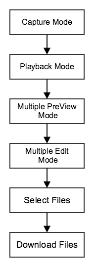

As we've just finished taking photos, the drone is in **Capture Mode**. From there we will need to navigate to **Playback Mode**, which is the general mode through which we can view and access media files. Within **Playback Mode** we have **Multiple Preview Mode**, which allows us to view multiple files at once in a grid layout. From there we can switch to **Multiple Edit Mode** which is the mode which allows downloading of media files. From there it's a simple matter of selecting and downloading the last 8 files on the SD card.

Let's confirm with the app user before setting off this chain of events. In our handler's **HANDLER_INSPIRE1_CAPTURE_IMAGES** case, upon successfully taking 8 photos it sends itself a **HANDLER_SHOW_STITCHING_OR_NOT_DIALOG** message, which we've left blank. Now we'll add the code to present a dialog box asking the user to confirm that they want to continue with the process:

~~~java
case HANDLER_SHOW_STITCHING_OR_NOT_DIALOG:
{
    //capture complete,show dialog,user determing stitching or cancel
    DialogInterface.OnClickListener positiveButtonOnClickListener=new DialogInterface.OnClickListener()
    {
        @Override
        public void onClick(DialogInterface dialog, int which)
        {
            //set dji camera playback mode
            handler.sendMessage(handler.obtainMessage(HANDLER_SET_DJI_CAMERA_PALYBACK_MODE, ""));
        }
    };
    DialogInterface.OnClickListener negativeButtonOnClickListener=new DialogInterface.OnClickListener()
    {
        @Override
        public void onClick(DialogInterface dialog, int which)
        {
            handler.sendMessage(handler.obtainMessage(HANDLER_SET_STITCHING_BUTTON_TEXT,getString(R.string.one_key_panorama)));
            handler.sendMessage(handler.obtainMessage(HANDLER_ENABLE_STITCHING_BUTTON,""));
        }
    };
	break;
    new AlertDialog.Builder(MainActivity.this).setTitle("Message").setMessage("Capture complete,stitching?").setPositiveButton("OK", positiveButtonOnClickListener).setNegativeButton("Cancel", negativeButtonOnClickListener).show();
}
~~~

Clicking the positive button in the dialog box that is created here will send the handler a **HANDLER_SET_DJI_CAMERA_PALYBACK_MODE** message, while pressing the negative button resets the stitching button text and enables it, effectively returning the user back to the beginning. Let's add the code to handle **HANDLER_SET_DJI_CAMERA_PALYBACK_MODE**. First the constant:

~~~java
private final int HANDLER_SET_DJI_CAMERA_PALYBACK_MODE = 2004;
~~~

Then the code in the handler:

~~~java
case HANDLER_SET_DJI_CAMERA_PALYBACK_MODE:
{
    //set camera playback mode to pull back images
    showCommonMessage("Set camera playback mode");
    CameraMode mode_playback = CameraMode.Camera_PlayBack_Mode;
    DJIDrone.getDjiCamera().setCameraMode(mode_playback, new DJIExecuteResultCallback()
    {
        @Override
        public void onResult(DJIError mErr)
        {
            if(mErr.errorCode==DJIError.RESULT_OK)
            {
                //enter multi preview mode
                new Thread()
                {
                    public void run()
                    {
                        try
                        {
                            Thread.sleep(3000);
                        }
                        catch(InterruptedException e)
                        {
                            e.printStackTrace();
                        }
                        //enter multi preview mode
                        handler.sendMessage(handler.obtainMessage(HANDLER_SET_DJI_CAMERA_MULTI_PREVIEW_MODE, ""));
                    }
                }.start();
            }
            else
            {
                handler.sendMessage(handler.obtainMessage(HANDLER_SHOW_COMMON_MESSAGE, "Set camera playback mode failed"));
            }
        }
    });
    break;
}
~~~

This code puts the drone into **Playback Mode**. This is done using the **setCameraMode()** function, which takes in a mode to set the camera to, and a callback function. We've defined our callback function to check the returned DJIError **mErr** to see if the camera mode has been succesfully set, sending the handler a new message if so. Else, it shows a common message.

Referring to the flowchart at the beginning of this section, we still have to navigate into **Multiple Preview Mode**, and then into **Multiple Edit Mode**. You can see that the code above calls **HANDLER_SET_DJI_CAMERA_MULTI_PREVIEW_MODE** in the callback function, which we'll add right now:

~~~java
private final int HANDLER_SET_DJI_CAMERA_MULTI_PREVIEW_MODE = 2005;
~~~

~~~java
case HANDLER_SET_DJI_CAMERA_MULTI_PREVIEW_MODE:
{
    //enter multi preview mode
    showCommonMessage("Enter multi preview mode");
    DJIDrone.getDjiCamera().enterMultiplePreviewMode(new DJIExecuteResultCallback()
    {
        @Override
        public void onResult(DJIError mErr)
        {
            if(mErr.errorCode==DJIError.RESULT_OK)
            {
                new Thread()
                {
                    public void run()
                    {
                        try
                        {
                            Thread.sleep(3000);
                        }
                        catch(InterruptedException e)
                        {
                            e.printStackTrace();
                        }
                        //enter multi edit mode
                        handler.sendMessage(handler.obtainMessage(HANDLER_SET_DJI_CAMERA_MULTI_EDIT_MODE, ""));
                    }
                }.start();
            }
            else
            {
                handler.sendMessage(handler.obtainMessage(HANDLER_SHOW_COMMON_MESSAGE, "Enter multi preview mode failed"));
            }
        }
    });
    break;
}
~~~

Likewise, **HANDLER_SET_DJI_CAMERA_MULTI_PREVIEW_MODE** calls **HANDLER_SET_DJI_CAMERA_MULTI_EDIT_MODE**. Let's add that in now. The code should be looking quite repetitive now:

~~~java
private final int HANDLER_SET_DJI_CAMERA_MULTI_EDIT_MODE = 2006;
~~~

~~~java
case HANDLER_SET_DJI_CAMERA_MULTI_EDIT_MODE:
{
    //enter multi edit mode
    showCommonMessage("Enter multi edit mode");
    DJIDrone.getDjiCamera().enterMultipleEditMode(new DJIExecuteResultCallback()
    {
        @Override
        public void onResult(DJIError mErr)
        {
            if(mErr.errorCode==DJIError.RESULT_OK)
            {
                new Thread()
                {
                    public void run()
                    {
                        try
                        {
                            Thread.sleep(3000);
                        }
                        catch(InterruptedException e)
                        {
                            e.printStackTrace();
                        }
                        //select page(max 8)
                        handler.sendMessage(handler.obtainMessage(HANDLER_SET_DJI_CAMERA_SELECT_PAGE, ""));
                    }
                }.start();
            }
            else
            {
                handler.sendMessage(handler.obtainMessage(HANDLER_SHOW_COMMON_MESSAGE, "Enter multi edit mode failed"));
            }
        }
    });
    break;
}
~~~

### Selecting Images

Now that our camera is in **Multiple Edit Mode**, we can proceed to select the last 8 photos taken and download them. We'll do this by first selecting all the photos in the current page - each page can contain at most 8 photos. If we have selected 8 photos, we can go ahead and download. If we have selected less than 8 photos, we navigate back a page and select the remaining photos. Here's the code for **HANDLER_SET_DJI_CAMERA_SELECT_PAGE**, which is the starting point of what we just described. This code will select all the images on the current page through the function **selectAllFilesInPage()**:

~~~java
private final int HANDLER_SET_DJI_CAMERA_SELECT_PAGE = 2007;
~~~

~~~java
case HANDLER_SET_DJI_CAMERA_SELECT_PAGE:
{
    //select page(max 8)
    showCommonMessage("Select all file in page");
    DJIDrone.getDjiCamera().selectAllFilesInPage(new DJIExecuteResultCallback()
    {
        @Override
        public void onResult(DJIError mErr)
        {
            if(mErr.errorCode==DJIError.RESULT_OK)
            {
                new Thread()
                {
                    public void run()
                    {
                        try
                        {
                            Thread.sleep(3000);
                        }
                        catch(InterruptedException e)
                        {
                            e.printStackTrace();
                        }
                        if(numbersOfSelected<CAPTURE_IMAGE_NUMBER)
                        {
                            //enter previous page
                            handler.sendMessage(handler.obtainMessage(HANDLER_SET_DJI_CAMERA_PREVIOUS_PAGE, ""));
                        }
                        else
                        {
                            //download selected
                            handler.sendMessage(handler.obtainMessage(HANDLER_SET_DJI_CAMERA_DOWNLOAD_SELECTED, ""));
                        }
                    }
                }.start();
            }
            else
            {
                handler.sendMessage(handler.obtainMessage(HANDLER_SHOW_COMMON_MESSAGE, "Select all file in page failed"));
            }
        }
        
    });
    break;
}
~~~

Here's **HANDLER_SET_DJI_CAMERA_PREVIOUS_PAGE** and **HANDLER_SET_DJI_CAMERA_SELECT_FILE_AT_INDEX**, which are called only if there aren't 8 images displayed and selected on the current page. the code in these two sections will access the previous page of images and select the remaining images needed:

~~~java
private final int HANDLER_SET_DJI_CAMERA_PREVIOUS_PAGE = 2008;
private final int HANDLER_SET_DJI_CAMERA_SELECT_FILE_AT_INDEX = 2009;
~~~

~~~java
case HANDLER_SET_DJI_CAMERA_PREVIOUS_PAGE:
{
    //if no enough in this page,go back previous page
    showCommonMessage("No enough images,go back previous page");
    DJIDrone.getDjiCamera().multiplePreviewPreviousPage(new DJIExecuteResultCallback()
    {
        @Override
        public void onResult(DJIError mErr)
        {
            if(mErr.errorCode==DJIError.RESULT_OK)
            {
                new Thread()
                {
                    public void run()
                    {
                        try
                        {
                            Thread.sleep(3000);
                        }
                        catch(InterruptedException e)
                        {
                            e.printStackTrace();
                        }
                        //go back previous page
                        handler.sendMessage(handler.obtainMessage(HANDLER_SET_DJI_CAMERA_SELECT_FILE_AT_INDEX, ""));
                    }
                }.start();
            }
            else
            {
                handler.sendMessage(handler.obtainMessage(HANDLER_SHOW_COMMON_MESSAGE, "Go back previous page failed"));
            }
        }
    });
    break;
}
~~~

We use **multiplePreviewPreviousPage()** to navigate to the previous page.

~~~java
case HANDLER_SET_DJI_CAMERA_SELECT_FILE_AT_INDEX:
{
    new Thread()
    {
        public void run()
        {
            showCommonMessage("Select rest "+(CAPTURE_IMAGE_NUMBER-numbersOfSelected)+" images");
            for(int i=numbersOfSelected;i<CAPTURE_IMAGE_NUMBER;i++)
            {
                //select single file
                DJIDrone.getDjiCamera().selectFileAtIndex(i, new DJIExecuteResultCallback()
                {
                    @Override
                    public void onResult(DJIError mErr)
                    {
                        if(mErr.errorCode==DJIError.RESULT_OK)
                        {
                            
                        }
                        else
                        {
                            
                        }
                    }
                });
                try
                {
                    Thread.sleep(1000);
                }
                catch (InterruptedException e)
                {
                    e.printStackTrace();
                }
            }
            try
            {
                Thread.sleep(1000);
            }
            catch (InterruptedException e)
            {
                e.printStackTrace();
            }
            //download selected
            handler.sendMessage(handler.obtainMessage(HANDLER_SET_DJI_CAMERA_DOWNLOAD_SELECTED, ""));
        }
    }.start();
    break;
}
~~~

Individual images are selected using the **selectFileAtIndex()** function.

### Downloading Images

Once we have all 8 photos selected, we just need to download them. Lets do that in **HANDLER_SET_DJI_CAMERA_DOWNLOAD_SELECTED**:

~~~java
private final int HANDLER_SET_DJI_CAMERA_DOWNLOAD_SELECTED = 2010;
~~~

We're also going to have to add the following constants and variables:

~~~java
private final String DOWNLOAD_IMAGE_DIRECTORY = "APPNAME";
private boolean isCheckDownloadImageFailure = false;
private int downloadImageFailedCount = 0;
~~~

And the following functions:

~~~java
private void showDownloadProgressDialog()
{
    if(mDownloadDialog != null)
    {
        mDownloadDialog.show();
        mDownloadDialog.setProgress(0);
    }
}

private void hideDownloadProgressDialog() {
    if (null != mDownloadDialog && mDownloadDialog.isShowing())
    {
        mDownloadDialog.dismiss();
    }
}
~~~

Do you remember way back when we initialized a Download Progress Dialog called **mDownloadDialog**? We're going to be displaying it here to track the download progress of our images, and hiding it after the download has completed, using the functions defined above.

Add the following code to your handler:

~~~java
case HANDLER_SET_DJI_CAMERA_DOWNLOAD_SELECTED:
{
    //download file
	File downloadPath = new File(STITCHING_SOURCE_IMAGES_DIRECTORY);
    DJIDrone.getDjiCamera().downloadAllSelectedFiles(downloadPath,new DJIFileDownloadCallBack()
    {
        @Override
        public void OnStart()
        {
            runOnUiThread(new Runnable()
            {               
                @Override
                public void run()
                {
                    showDownloadProgressDialog();
                }
            });
        }
        
        @Override
        public void OnError(Exception exception)
        {
            if(isCheckDownloadImageFailure)
            {
                downloadImageFailedCount++;
                handler.sendMessage(handler.obtainMessage(HANDLER_SHOW_COMMON_MESSAGE, "Downloading images on error"));
            }
        }
        
        @Override
        public void OnEnd()
        {
            new Thread()
            {
                public void run()
                {
                    handler.sendMessage(handler.obtainMessage(HANDLER_SET_DJI_CAMERA_FINISH_DOWNLOAD_FILES,""));
                    handler.sendMessage(handler.obtainMessage(HANDLER_SHOW_COMMON_MESSAGE, "Download finished"));
                    try
                    {
                        Thread.sleep(3000);
                    }
                    catch (InterruptedException e)
                    {
                        e.printStackTrace();
                    }
                    handler.sendMessage(handler.obtainMessage(HANDLER_SET_DJI_CAMERA_CAPTURE_MODE,""));
                    try
                    {
                        Thread.sleep(3000);
                    }
                    catch (InterruptedException e)
                    {
                        e.printStackTrace();
                    }
                    //some images download failed
                    if(downloadImageFailedCount!=0)
                    {
                        handler.sendMessage(handler.obtainMessage(HANDLER_SHOW_COMMON_MESSAGE, "Check "+downloadImageFailedCount+" images download failed,Task Abort!"));
                        downloadImageFailedCount=0;
                        handler.sendMessage(handler.obtainMessage(HANDLER_SET_STITCHING_BUTTON_TEXT,getString(R.string.one_key_panorama)));
                        handler.sendMessage(handler.obtainMessage(HANDLER_ENABLE_STITCHING_BUTTON,""));
                    }
                    else
                    {
                        handler.sendMessage(handler.obtainMessage(HANDLER_SHOW_COMMON_MESSAGE, "Check "+CAPTURE_IMAGE_NUMBER+" images download all success,stitching...."));
                        try
                        {
                            Thread.sleep(3000);
                        }
                        catch (InterruptedException e)
                        {
                            e.printStackTrace();
                        }
                        handler.sendMessage(handler.obtainMessage(HANDLER_START_STITCHING,""));
                    }
                }
            }.start();
        }
        
        @Override
        public void OnProgressUpdate(final int progress)
        {
            runOnUiThread(new Runnable()
            {
                @Override
                public void run()
                {
                    if(mDownloadDialog!=null)
                    {
                        mDownloadDialog.setProgress(progress);
                    }
                    if(progress>=100)
                    {
                        hideDownloadProgressDialog();
                    }
                }
            });
        }
    });
    break;
}
~~~

That may seem like a big chunk of code, but it is just a single call to **downloadAllSelectedFiles()** and a definition of the callback function to use. The callback itself has several functions to call to handle the different stages of the download life cycle:
 - **OnStart()** calls **showDownloadProgressDialog()**.
 - **OnError()** only acts if the boolean **isCheckDownloadImageFailure** is set to true, which is your choice to do so or not. If so, it will increment a variable **downloadImageFailedCount** and show a common message alerting the user of a download error.
 - **OnProgressUpdate()** takes in an int **progress** and uses it to update **mDownloadDialog**. If the download is complete, it hides **mDownloadDialog** instead.
 - **OnEnd()** sends the handler **HANDLER_SET_DJI_CAMERA_FINISH_DOWNLOAD_FILES**, which finished up the download and shows a common message verifying whether the download has succeeded or failed. It then sends the handler **HANDLER_SET_DJI_CAMERA_CAPTURE_MODE**. If the download has failed, it sends the handler **HANDLER_SET_STITCHING_BUTTON_TEXT** and **HANDLER_ENABLE_STITCHING_BUTTON**, returning the app to a state ready to take another panorama. Otherwise, it calls **HANDLER_START_STITCHING** to start stitching the photos together into a panorama. 

Add the following handler switch cases:

~~~java
private final int HANDLER_START_STITCHING = 1002;
private final int HANDLER_SET_DJI_CAMERA_CAPTURE_MODE = 2003;
private final int HANDLER_SET_DJI_CAMERA_FINISH_DOWNLOAD_FILES = 2011;
~~~

~~~java
case HANDLER_SET_DJI_CAMERA_FINISH_DOWNLOAD_FILES:
{
    //finish download
    DJIDrone.getDjiCamera().finishDownloadAllSelectedFiles(new DJIExecuteResultCallback()
    {
        @Override
        public void onResult(DJIError mErr)
        {
            if(mErr.errorCode==DJIError.RESULT_OK)
            {
                handler.sendMessage(handler.obtainMessage(HANDLER_SHOW_COMMON_MESSAGE, "Finished download"));
            }
            else
            {
                handler.sendMessage(handler.obtainMessage(HANDLER_SHOW_COMMON_MESSAGE, "Finished download failed"));
            }
        }
    });
    break;
}
case HANDLER_SET_DJI_CAMERA_CAPTURE_MODE:
{
    CameraMode mode=CameraMode.Camera_Capture_Mode;
    DJIDrone.getDjiCamera().setCameraMode(mode, new DJIExecuteResultCallback()
    {
        @Override
        public void onResult(DJIError mErr)
        {
            if(mErr.errorCode==DJIError.RESULT_OK)
            {
                
            }
            else
            {
                handler.sendMessage(handler.obtainMessage(HANDLER_SHOW_COMMON_MESSAGE, "Set camera capture mode failed"));
            }
        }
    });
    break;
}
case HANDLER_START_STITCHING:
{
    // Start stitching
    break;
}
~~~

Give your code another run (make sure you have put an SD card into your drone first). You should find that it automatically downloads all 8 photos onto your device, which you can locate in your "APPNAME" folder.

**Note: Due to a bug in the DJI SDK, your app may sometimes get stuck downloading at 87%. If this happens, just restart the app and your drone.**

## Creating the Panorama

### Stitching the images together

Now that we have the 8 images locally accessible, we can stitch together to create a panorama. This happens in **HANDLER_START_STITCHING**, which we created but did not fill with actual code in the last section, but will do now. Start by adding the following variables and constants:

~~~java
private boolean isDIsableDJIVideoPreviewDuringStitching = true; // Disable video preview during stitching to save CPU and memory usage. 
																//Change this boolean to false to keep video preview enabled
private boolean isStitchingCompleted = false;
private String stitchingResultImagePath="";
private final double STITCH_IMAGE_SCALE = 0.5;
private final int HANDLER_ENABLE_DJI_VIDEO_PREVIEW = 2012;
private final int HANDLER_DISABLE_DJI_VIDEO_PREVIEW = 2013;

public native int jnistitching(String[] source,String result,double scale);
~~~

And the code for **HANDLER_START_STITCHING**:

~~~java
case HANDLER_START_STITCHING:
{
    if(isDIsableDJIVideoPreviewDuringStitching)
    {
        new Thread()
        {
            public void run()
            {
                handler.sendMessage(handler.obtainMessage(HANDLER_DISABLE_DJI_VIDEO_PREVIEW,""));  //disable dji video preview
                while(isStitchingCompleted==false)
                {
                    handler.sendMessage(handler.obtainMessage(HANDLER_SHOW_COMMON_MESSAGE, getString(R.string.video_preview_disabled_during_stitching)));
                    try
                    {
                        sleep(4000);
                    }
                    catch(InterruptedException e)
                    {
                        e.printStackTrace();
                    }
                }
            }
        }.start();
    }

    handler.sendMessage(handler.obtainMessage(HANDLER_SET_STITCHING_BUTTON_TEXT,"Stitching...."));
    new Thread()
    {
        public void run()
        {
            isStitchingCompleted=false;
            String[] source=getDirectoryFilelist(STITCHING_SOURCE_IMAGES_DIRECTORY);
            stitchingResultImagePath=STITCHING_RESULT_IMAGES_DIRECTORY+getCurrentDateTime()+"result.jpg";
            if(jnistitching(source, stitchingResultImagePath, STITCH_IMAGE_SCALE)==0)
            {
                handler.sendMessage(handler.obtainMessage(HANDLER_SET_STITCHING_BUTTON_TEXT,"Stitching success"));
            }
            else
            {
                handler.sendMessage(handler.obtainMessage(HANDLER_SET_STITCHING_BUTTON_TEXT,"Stitching error"));
            }
            handler.sendMessage(handler.obtainMessage(HANDLER_SET_STITCHING_BUTTON_TEXT,getString(R.string.one_key_panorama)));
            handler.sendMessage(handler.obtainMessage(HANDLER_ENABLE_STITCHING_BUTTON,""));
            handler.sendMessage(handler.obtainMessage(HANDLER_ENABLE_DJI_VIDEO_PREVIEW,""));
            isStitchingCompleted=true;
        }
    }.start();
    break;
}
~~~

And these smaller helper cases/functions:

~~~java
case HANDLER_DISABLE_DJI_VIDEO_PREVIEW:
{
    DJIDrone.getDjiCamera().setReceivedVideoDataCallBack(null);
    break;
}
case HANDLER_ENABLE_DJI_VIDEO_PREVIEW:
{
    DJIDrone.getDjiCamera().setReceivedVideoDataCallBack(mReceivedVideoDataCallBack);
    break;
}
~~~

~~~java
private String[] getDirectoryFilelist(String directory)
{
    String[] filelist;
    File sourceDirectory = new File(STITCHING_SOURCE_IMAGES_DIRECTORY);
    int index=0;
    int folderCount=0;
    //except folders
    for(File file : sourceDirectory.listFiles())
    {
        if(file.isDirectory())
        {
            folderCount++;
        }
    }
    filelist=new String[sourceDirectory.listFiles().length-folderCount];
    for(File file : sourceDirectory.listFiles())
    {
        if(!file.isDirectory())
        {
            //showLOG("getFilelist file:"+file.getPath());
            filelist[index]=file.getPath();
            index++;
        }
    }
    return filelist;
}

private String getCurrentDateTime()
{
    Calendar c = Calendar .getInstance();
    SimpleDateFormat df = new SimpleDateFormat("yyyyMMddHHmmss",Locale.getDefault());
    return df.format(c.getTime());
}
~~~

There are two threads in **HANDLER_START_STITCHING**. The first disables the video feed and repeatedly shows a common message stating that the video preview has been disabled while the boolean **isStitchingCompleted** is false. The second thread carries out the stitching of the images, and sets **isStitchingCompleted** to true after it has finished.

The actual stitching process is carried out in a function called **jnistitching**. One of the objects that we declared at the beginning of this section was:

~~~java
public native int jnistitching(String[] source,String result,double scale);
~~~
Once of the parameters of this function is a double **scale**, which we set to **STITCH_IMAGE_SCALE**. Mobile devices have limited computational power and memory, so stitching together a panorama from eight full resolution photos may not be feasible. We scale the images down to combat this issue.

This is a native function, meaning that its code is in a different programming language, and exists in a library elsewhere. Fortunately, we have provided this code for you. To use it though, you're going to have to first add Android support for your project. This will work only if you have already downloaded and set up Android NDK, as directed in the very first part of this tutorial.

Right click on your project -> Android Tools -> Add Native Support. A new folder named **jni** will be created in your project. Within it will be two files: **APPNAME.cpp** and **Android.mk** (APPNAME being your app name).

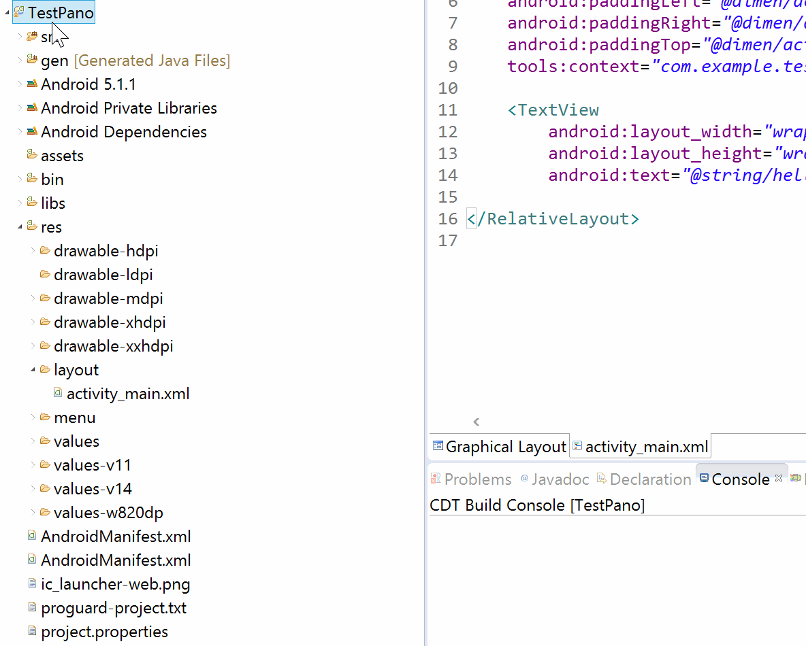

Look into the demo project **PanoDemo**'s **jni** folder and locate the file **Application.mk**. Copy it into your **jni** folder. Open up the demo project's **Android.mk** file and replace the contents of your **Android.mk** file with it's contents. Find the following two lines of code and replace **PanoDemo** with your app name:

~~~
LOCAL_MODULE    := PanoDemo // Replace with your own app's name
LOCAL_SRC_FILES := PanoDemo.cpp // Here too
~~~

Replace the contents of your **APPNAME.cpp** file with the demo project's **PanoDemo.cpp** file. Locate these 4 lines of code:

~~~cpp
JNIEXPORT jstring JNICALL Java_com_dji_dev_panodemo_MainActivity_testjni(JNIEnv *env, jobject obj)
...
JNIEXPORT jint JNICALL Java_com_dji_dev_panodemo_MainActivity_jnistitching(JNIEnv *env, jobject obj, jobjectArray source, jstring result, jdouble scale);
...
JNIEXPORT jstring JNICALL Java_com_dji_dev_panodemo_MainActivity_testjni(JNIEnv *env, jobject obj)
...
JNIEXPORT jint JNICALL Java_com_dji_dev_panodemo_MainActivity_jnistitching(JNIEnv *env, jobject obj, jobjectArray source, jstring result, jdouble scale)
~~~

In each of these lines, replace **com_dji_dev_panodemo** with your own package name, following the convention of using underscores rather than periods.

Now, when our code calls the function **jnistitching()**, it'll carry out the C++ method in our **APPNAME.cpp** file.

The **jnistitching()** method, in the **APPNAME.cpp** file, calls upon a function **javaShowJniStitchingCostTime()** at the end of its code. It expects to find this function back in our **MainActivity.java** file, so we'll just quickly add an empty function so that our code can compile:

~~~java
private void javaShowJniStitchingCostTime(double costTime)
{
	// Show jnistitching cost time
}
~~~

Lastly, we need to load the library of C++ functions that we want to use. Add the following at the top of your class, above all your constants and global variables:

~~~java
//Load jni library
static
{
	System.loadLibrary("APPNAME");
}
~~~

Great! Compile and run your code. You should find that your app spends a few minutes telling you that it's stitching together a panorama, but doing nothing to confirm that it has finished doing so when it's done. However, if you navigate to your **APPNAME/results** folder on your device, you should find a finished panorama image!

### Displaying the results

Ideally, we'd like the user to know when the panorama has finished being processed. We'd also like to let them quickly access this panorama. With a dialogue box asking users if they'd like to be taken to the finished image, we can kill two birds with one stone!

Let's go back and edit our **javaShowJniStitchingCostTime()** function so that it sends our handler a message:

~~~java
private void javaShowJniStitchingCostTime(double costTime)
{
    handler.sendMessage(handler.obtainMessage(HANDLER_JAVA_SHOW_JNI_STITCHING_COST_TIME,""+costTime));
}
~~~

Now lets add some code to our handler so it knows how to handle this message:

~~~
private final int HANDLER_JAVA_SHOW_JNI_STITCHING_COST_TIME = 1004;
~~~

And:

~~~java
case HANDLER_JAVA_SHOW_JNI_STITCHING_COST_TIME:
{
    String costTime_str=(String)msg.obj;  //original str like this:19.492691
    costTime_str=costTime_str.substring(0, costTime_str.indexOf('.')+2);  //result like this:19.4
    showLOG("java:jniStitching cost time= "+costTime_str+" seconds");
    //show open or done dialog
    DialogInterface.OnClickListener positiveButtonOnClickListener=new DialogInterface.OnClickListener()
    {
        @Override
        public void onClick(DialogInterface dialog, int which)
        {
            //set dji camera playback mode
            handler.sendMessage(handler.obtainMessage(HANDLER_SHOW_STITCHING_RESULT_IMAGEVIEW, ""));
        }
        
    };
    new AlertDialog.Builder(MainActivity.this).setTitle("Stitching success").setMessage("Cost time "+costTime_str+" seconds").setPositiveButton("Open", positiveButtonOnClickListener).setNegativeButton("Done", null).show();
    break;
}
~~~

This code just displays a dialog box. **HANDLER_SHOW_STITCHING_RESULT_IMAGEVIEW** will handle actually taking the user to the image:

~~~java
private final int HANDLER_SHOW_STITCHING_RESULT_IMAGEVIEW = 1006;
~~~

~~~java
case HANDLER_SHOW_STITCHING_RESULT_IMAGEVIEW:
{
    //use android system imageview
    File file = new File(stitchingResultImagePath);
    if(file != null && file.isFile())
    {
        Intent intent = new Intent();
        intent.setAction(android.content.Intent.ACTION_VIEW);
        intent.setDataAndType(Uri.fromFile(file), "image/*");
        startActivity(intent);   
    }
    break;
}
~~~

And now your app is done! Run your code and enjoy your very own panorama app!

## Final Touches

### Adding Phantom 3 Professional Support

If you're using a Phantom 3 Professional and not an Inspire 1, don't worry, we haven't forgotten about you! There are a couple minor tweaks to take care of, and one major adjustment we will have to make to our photo taking algorithm.

With the Inspire 1, we just rotated the gimbal 360 degrees, taking 8 photos along the way. However, the Phantom 3 Professional's gimbal does not have the ability to rotate 360 degrees. This is as in some of the angles its legs would be visible, while the Inspire 1's legs lift up out of the field of view. 

Consequently, instead of rotating the gimbal to take photos, we're going to have to rotate the entire drone. With the DJI SDK, there are two different ways we can perform this simple task. The first uses Flight Control (previously called Joystick), which allows you to manipulate the drone through its basic properties of yaw, roll, pitch and throttle. The second uses waypoints, which are physical destinations at which the drone will carry out a series of tasks - in this case, the tasks to carry out will be to rotate and to capture photos. The advantage of waypoints is that we will not have to call **sleep()** in between commands, as waypoints are designed to take care of giving the drone time to execute commands. Both of the Flight Control and waypoints are components of Intelligent Navigation (previously called Groundstation).

One of the global variables I had you declare was a **DJIDroneType** object **mDroneType**. In **startDJICamera()**, a function called when the start button is pressed, we execute this line:

~~~java
mDroneType = DJIDrone.getDroneType();
~~~

With this variable in place, we can go into our **onClick()** function, and under the R.id.stitchingButton switch case, edit the if statement to include an extra scenario:

~~~java
if(mDroneType==DJIDroneType.DJIDrone_Inspire1)
{
    handler.sendMessage(handler.obtainMessage(HANDLER_INSPIRE1_CAPTURE_IMAGES,""));
}
else if(mDroneType == DJIDroneType.DJIDrone_Phantom3_Professional)
{
    //we have two examples:joystick and waypoint action
    DialogInterface.OnClickListener useFlightControlButton = new DialogInterface.OnClickListener()
    {
        @Override
        public void onClick(DialogInterface dialog, int which)
        {
            handler.sendMessage(handler.obtainMessage(HANDLER_PHANTOM3PROFESSIONAL_CAPTURE_IMAGES, ""));
        }
    };
    DialogInterface.OnClickListener useWaypointsButton=new DialogInterface.OnClickListener()
    {
        @Override
        public void onClick(DialogInterface dialog, int which)
        {
            handler.sendMessage(handler.obtainMessage(HANDLER_PHANTOM3PROFESSIONAL_WA_CAPTURE_IMAGES, ""));
        }
    };
    new AlertDialog.Builder(MainActivity.this).setTitle("Message").setMessage("Use Flight Control or Waypoints?").setPositiveButton("Flight Control", useFlightControlButton).setNegativeButton("Waypoints", useWaypointsButton).show();
}
else
{
    showCommonMessage(getString(R.string.unsupported_drone));
}
~~~

Now if your app is connected to a Phantom 3 Professional, when **stitchingButton** is pressed, the app will display an alert dialog asking the user to choose between using Flight Control and Waypoints. Depending on the user's choice, the app will either send the handler a **HANDLER_PHANTOM3PROFESSIONAL_CAPTURE_IMAGES** or a **HANDLER_PHANTOM3PROFESSIONAL_WA_CAPTURE_IMAGES** message.

Add the code for **HANDLER_PHANTOM3PROFESSIONAL_CAPTURE_IMAGES** as shown below:

~~~java
private final int HANDLER_PHANTOM3PROFESSIONAL_CAPTURE_IMAGES = 2001;
~~~

~~~java
case HANDLER_PHANTOM3PROFESSIONAL_CAPTURE_IMAGES:
{
    new Thread()
    {
        public void run()
        {
            isGroundstationOpenSuccess=false;
            DJIDrone.getDjiGroundStation().openGroundStation(new DJIGroundStationExecuteCallBack()
            {
                @Override
                public void onResult(GroundStationResult result)
                {
                    handler.sendMessage(handler.obtainMessage(HANDLER_SHOW_COMMON_MESSAGE, result.toString()));
                    if(result==GroundStationResult.GS_Result_Successed)
                    {
                        isGroundstationOpenSuccess=true;
                    }
                }
            });
            try
            {
                sleep(3000);
            }
            catch(InterruptedException e)
            {
                e.printStackTrace();
            }
            if(isGroundstationOpenSuccess==false)
            {
                handler.sendMessage(handler.obtainMessage(HANDLER_SET_STITCHING_BUTTON_TEXT,getString(R.string.one_key_panorama)));
                handler.sendMessage(handler.obtainMessage(HANDLER_ENABLE_STITCHING_BUTTON,""));
                return;
            }
            showCommonMessage(getString(R.string.groundstation_take_control));
            try
            {
                sleep(3000);
            }
            catch(InterruptedException e)
            {
                e.printStackTrace();
            }
            showCommonMessage("Set yaw control mode to angle");
            DJIDrone.getDjiGroundStation().setYawControlMode(DJINavigationFlightControlYawControlMode.Navigation_Flight_Control_Yaw_Control_Angle);
            try
            {
                sleep(3000);
            }
            catch(InterruptedException e)
            {
                e.printStackTrace();
            }
            //rotate yaw to take photos
            int imgIndex=0;
            for(int i=0;i<180;i+=(360/CAPTURE_IMAGE_NUMBER))
            {
                imgIndex++;
                showCommonMessage(getString(R.string.capturing_image)+" "+imgIndex+"/"+CAPTURE_IMAGE_NUMBER);
                DJIDrone.getDjiGroundStation().sendFlightControlData(i, 0, 0, 0, new DJIExecuteResultCallback()
                {
                    @Override
                    public void onResult(DJIError mErr)
                    {
                        if(mErr.errorCode==DJIError.RESULT_OK)
                        {
                            
                        }
                        else
                        {
                            
                        }
                    }
                });
                try
                {
                    sleep(4000);
                }
                catch(InterruptedException e)
                {
                    e.printStackTrace();
                }
                DJICameraTakePhoto();
                try
                {
                    sleep(3000);
                }
                catch(InterruptedException e)
                {
                    e.printStackTrace();
                }
            }
            for(int i=-180;i<0;i+=(360/CAPTURE_IMAGE_NUMBER))
            {
                imgIndex++;
                showCommonMessage(getString(R.string.capturing_image)+imgIndex+"/"+CAPTURE_IMAGE_NUMBER);
                DJIDrone.getDjiGroundStation().sendFlightControlData(i, 0, 0, 0, new DJIExecuteResultCallback()
                {
                    @Override
                    public void onResult(DJIError mErr)
                    {
                        if(mErr.errorCode==DJIError.RESULT_OK)
                        {
                            
                        }
                        else
                        {
                            
                        }
                    }
                });
                try
                {
                    sleep(4000);
                }
                catch(InterruptedException e)
                {
                    e.printStackTrace();
                }
                DJICameraTakePhoto();
                try
                {
                    sleep(3000);
                }
                catch(InterruptedException e)
                {
                    e.printStackTrace();
                }
            }
            //yaw back to init
            showCommonMessage(getString(R.string.capture_image_complete));
            DJIDrone.getDjiGroundStation().sendFlightControlData(0, 0, 0, 0, new DJIExecuteResultCallback()
            {
                @Override
                public void onResult(DJIError mErr)
                {
                    if(mErr.errorCode==DJIError.RESULT_OK)
                    {
                        
                    }
                    else
                    {
                        
                    }
                }
            });
            try
            {
                sleep(4000);
            }
            catch(InterruptedException e)
            {
                e.printStackTrace();
            }
            //close groundstation
            DJIDrone.getDjiGroundStation().closeGroundStation(new DJIGroundStationExecuteCallBack()
            {
                @Override
                public void onResult(GroundStationResult result)
                {
                    handler.sendMessage(handler.obtainMessage(HANDLER_SHOW_COMMON_MESSAGE, result.toString()));
                }
            });
            showCommonMessage(getString(R.string.capture_image_complete));
            try
            {
                Thread.sleep(3000);
            }
            catch(InterruptedException e)
            {
                e.printStackTrace();
            }
            if(captureImageFailedCount!=0)
            {
                showCommonMessage("Check "+captureImageFailedCount+" images capture failed,Task Abort!");
                captureImageFailedCount=0;
                handler.sendMessage(handler.obtainMessage(HANDLER_SET_STITCHING_BUTTON_TEXT,getString(R.string.one_key_panorama)));
                handler.sendMessage(handler.obtainMessage(HANDLER_ENABLE_STITCHING_BUTTON,""));
            }
            else
            {
                showCommonMessage("Check "+CAPTURE_IMAGE_NUMBER+" images capture all success,continue....");
                try
                {
                    Thread.sleep(3000);
                }
                catch (InterruptedException e)
                {
                    e.printStackTrace();
                }
                //show dialog
                handler.sendMessage(handler.obtainMessage(HANDLER_SHOW_STITCHING_OR_NOT_DIALOG, ""));
            }
        }
    }.start();
    break;
}
~~~

Add the global variable:

~~~java
private boolean isGroundstationOpenSuccess = false;
~~~

Let's run through this code bit by bit.

First, we call **openGroundStation()**, setting a boolean **isGroundstationOpenSuccess** to true if this executes successfully. Grounstation is a class used to control drone movement, and we'll be using its functions.

Next, we check **isGroundstationOpenSuccess**, returning back to a live video feed with **stitchingButton** enabled so the user can start the process over if they please.

To spin the drone about a vertical axis, we will need to control its yaw. We use **setYawControlMode** to **Navigation_Flight_Control_Yaw_Control_Angle**, which basically means that we'll be inputting absolute angles for the drone to spin to.

We then use two for loops, one spinning the drone from 0 to 180 degrees, taking 4 photos along the way, and another spinning the drone from -180 to 0 degrees, taking another 4 photos. The degree system for the drone covers a range of 360 degrees, but labels them from -180 to 180 degrees. Hence, to avoid confusion, we have separated the process into two distinct for loops.

Next, we rotate the drone back to 0 degrees, and close the groundstation using the **closeGroundStation()** method.

Our last segment of code checks the integer **captureImageFailedCount** which, if you recall, gets incremented in **DJICameraTakePhoto()** if a photo capture fails.

With Flight Control, we've primarily used functions such as **sendFlightControlData()** to control the drone. Now we'll be using Waypoints to achieve the same results. Add the following switch case into your handler:

~~~java
private final int HANDLER_PHANTOM3PROFESSIONAL_WA_CAPTURE_IMAGES = 2002;
~~~

~~~java
case HANDLER_PHANTOM3PROFESSIONAL_WA_CAPTURE_IMAGES:
{
      //use waypoint action
    new Thread()
    {
        public void run()
        {
            isGroundstationOpenSuccess=false;
            DJIDrone.getDjiGroundStation().openGroundStation(new DJIGroundStationExecuteCallBack()
            {
                @Override
                public void onResult(GroundStationResult result)
                {
                    handler.sendMessage(handler.obtainMessage(HANDLER_SHOW_COMMON_MESSAGE, result.toString()));
                    if(result==GroundStationResult.GS_Result_Success)
                    {
                        isGroundstationOpenSuccess=true;
                    }
                }
            });
            try
            {
                sleep(3000);
            }
            catch(InterruptedException e)
            {
                e.printStackTrace();
            }
            if(isGroundstationOpenSuccess==false)
            {
                handler.sendMessage(handler.obtainMessage(HANDLER_SET_STITCHING_BUTTON_TEXT,getString(R.string.one_key_panorama)));
                handler.sendMessage(handler.obtainMessage(HANDLER_ENABLE_STITCHING_BUTTON,""));
                return;
            }
            showCommonMessage(getString(R.string.groundstation_take_control));
            try
            {
                sleep(3000);
            }
            catch(InterruptedException e)
            {
                e.printStackTrace();
            }
            showCommonMessage("Uploading GroundStation Task...");
            DJIDrone.getDjiGroundStation().setHorizontalControlCoordinateSystem(DJINavigationFlightControlCoordinateSystem.Navigation_Flight_Control_Coordinate_System_Body);
            //NOTE:new version sdk V2.3.0 need at least two waypoint;one waypoint no more than 16 action,largest is 15
            //this waypoint use to init drone yaw to 0
            DJIGroundStationWaypoint waypoint1=new DJIGroundStationWaypoint(droneLocationLatitude, droneLocationLongitude);
            waypoint1.altitude=(float)droneAltitude+0.1f;  //the unit is meter  //why add 0.1,see this bug:http://forum.dji.com/thread-28359-1-1.html
            waypoint1.action.actionRepeat=1;
            waypoint1.hasAction = true;
            waypoint1.heading = 0;
            waypoint1.actionTimeout = 60*10;  //The unit is s
            waypoint1.turnMode = 1;
            waypoint1.dampingDistance = 0.5f;
            waypoint1.addAction(GroundStationOnWayPointAction.Way_Point_Action_Craft_Yaw, 0);
            //this waypoint use to rotate drone yaw and take picture
            DJIGroundStationWaypoint waypoint2=new DJIGroundStationWaypoint(droneLocationLatitude, droneLocationLongitude);
            waypoint2.altitude=(float)droneAltitude+0.2f;  //the unit is meter
            waypoint2.action.actionRepeat=1;
            waypoint2.hasAction = true;
            waypoint2.heading = 0;
            waypoint2.actionTimeout = 60*10;  //The unit is s
            waypoint2.turnMode = 1;
            waypoint2.dampingDistance = 0.5f;
            for(int i=0;i<180;i+=(360/CAPTURE_IMAGE_NUMBER))
            {
                  //ignore first yaw position 0,because we only have max 15 action,so bad
                  if(i!=0)
                  {
                        waypoint2.addAction(GroundStationOnWayPointAction.Way_Point_Action_Craft_Yaw, i);
                  }
                  waypoint2.addAction(GroundStationOnWayPointAction.Way_Point_Action_Simple_Shot, 1);
            }
            for(int i=-180;i<0;i+=(360/CAPTURE_IMAGE_NUMBER))
            {
                  waypoint2.addAction(GroundStationOnWayPointAction.Way_Point_Action_Craft_Yaw, i);
                  waypoint2.addAction(GroundStationOnWayPointAction.Way_Point_Action_Simple_Shot, 1);
            }
            //this waypoint use to reset drone yaw position to 0
            DJIGroundStationWaypoint waypoint3=new DJIGroundStationWaypoint(droneLocationLatitude, droneLocationLongitude);
            waypoint3.altitude=(float)droneAltitude+0.3f;  //the unit is meter
            waypoint3.action.actionRepeat=1;
            waypoint3.hasAction = true;
            waypoint3.heading = 0;
            waypoint3.actionTimeout = 60*10;  //The unit is s
            waypoint3.turnMode = 1;
            waypoint3.dampingDistance = 0.5f;
            waypoint3.addAction(GroundStationOnWayPointAction.Way_Point_Action_Craft_Yaw, 0);  //reset drone yaw to 0
            //generate gs task
            DJIGroundStationTask task=new DJIGroundStationTask();
            task.addWaypoint(waypoint1);
            task.addWaypoint(waypoint2);
            task.addWaypoint(waypoint3);
            task.finishAction=DJIGroundStationFinishAction.None;
            //upload gs task to drone
            DJIDrone.getDjiGroundStation().uploadGroundStationTask(task, new DJIGroundStationExecuteCallBack()
            {
                  @Override
                  public void onResult(GroundStationResult result)
                  {
                        if(result==GroundStationResult.GS_Result_Success)
                        {
                              showCommonMessage("Upload GroundStation Task success");
                        }
                        else
                        {
                              showCommonMessage("Upload GroundStation Task failed:"+result.toString());
                        handler.sendMessage(handler.obtainMessage(HANDLER_SET_STITCHING_BUTTON_TEXT,getString(R.string.one_key_panorama)));
                        handler.sendMessage(handler.obtainMessage(HANDLER_ENABLE_STITCHING_BUTTON,""));
                        return;
                        }
                  }
            });
            try
            {
                sleep(5000);
            }
            catch(InterruptedException e)
            {
                e.printStackTrace();
            }
            //start gs task
                  DJIDrone.getDjiGroundStation().startGroundStationTask(new DJIGroundStationExecuteCallBack()
                  {
                        @Override
                        public void onResult(GroundStationResult result)
                        {
                              if(result==GroundStationResult.GS_Result_Success)
                              {
                                    showCommonMessage("Start GroundStation Task success");
                              }
                              else
                              {
                                    showCommonMessage("Start GroundStation Task failed:"+result.toString());
                        handler.sendMessage(handler.obtainMessage(HANDLER_SET_STITCHING_BUTTON_TEXT,getString(R.string.one_key_panorama)));
                        handler.sendMessage(handler.obtainMessage(HANDLER_ENABLE_STITCHING_BUTTON,""));
                        return;
                              }
                        }
                  });
            try
            {
                sleep(3000);
            }
            catch(InterruptedException e)
            {
                e.printStackTrace();
            }
        }
    }.start();
    break;
}
~~~

In the above code we make use of the drone's current position through the variables **droneAltitude**, **droneLocationLatitude** and **droneLocationLongitude**. Start by initializing them as global variables:

~~~java
private double droneAltitude=0.0;  //drone altitude
private double droneLocationLatitude = 0.0, droneLocationLongitude = 0.0;  //drone gps data
~~~

Next, in your **startDJICamera()** function, where we have declared and initialized all our callbacks, add a new callback:

~~~java
//main controller
mDjiMcuUpdateStateCallBack=new DJIMcuUpdateStateCallBack()
{
	@Override
	public void onResult(DJIMainControllerSystemState state)
	{
		droneAltitude=state.altitude;
		droneLocationLatitude=state.droneLocationLatitude;
		droneLocationLongitude=state.droneLocationLongitude;
	}
};
~~~

And declare it:

~~~java
private DJIMcuUpdateStateCallBack mDjiMcuUpdateStateCallBack;
~~~

And, at the end of **startDJICamera()**, set it as the callback function for the DjiMainController:

~~~java
DJIDrone.getDjiMainController().setMcuUpdateStateCallBack(mDjiMcuUpdateStateCallBack);
~~~

Now, when the location of the drone changes, our variables **droneAltitude**, **droneLocationLatitude** and **droneLocationLongitude** will be updated.

Let's run through all of **HANDLER_PHANTOM3PROFESSIONAL_WA_CAPTURE_IMAGES**. Just as in **HANDLER_PHANTOM3PROFESSIONAL_CAPTURE_IMAGES**, we start by opening the GroundStation. Next, we create three waypoints **waypoint1**, **waypoint2** and **waypoint3**. In theory, each of these waypoints represents a different physical location for the drone to carry out tasks at. However, our app does not require our drone to move, only to rotate, so why do we have three different waypoints? Unfortunately, only fifteen tasks can be performed at any one waypoint, so we must create multiple waypoints.

Lets take a look at **waypoint1** to familiarize ourselves with how waypoints work:

~~~java
DJIGroundStationWaypoint waypoint1=new DJIGroundStationWaypoint(droneLocationLatitude, droneLocationLongitude);
waypoint1.altitude=(float)droneAltitude+0.1f;  //the unit is meter  //why add 0.1,see this bug:http://forum.dji.com/thread-28359-1-1.html
waypoint1.action.actionRepeat=1;
waypoint1.hasAction = true;
waypoint1.heading = 0;
waypoint1.actionTimeout = 60*10;  //The unit is s
waypoint1.turnMode = 1;
waypoint1.dampingDistance = 0.5f;
waypoint1.addAction(GroundStationOnWayPointAction.Way_Point_Action_Craft_Yaw, 0);
~~~

All of the lines of code but the last initialize the behavior of the waypoint. You can read more about the specific values in the SDK documentation. The last line adds an Action, which the drone will carry out at the waypoint. This specific action sets the drone's yaw to a value of 0. We also set the altitude to **droneAltitude** + 0.1f. We will be slightly adjusting the drone's height between waypoints in order to sidestep this bug http://forum.dji.com/thread-28359-1-1.html.

**waypoint2** has fifteen Actions added to it: seven telling the drone to rotate, and eight telling the drone to take a photo. We only have seven Actions telling the drone to spin as the drone does not need to spin before taking its first photo.

Lastly, **waypoint3** sets the drone to face in its initial direction of 0, just as with **waypoint1**.

We then create a Groundstation Task **task** and add these three waypoints to it. We set **task.finishAction** so that nothing happens when the drone finishes executing all Actions of the waypoints. We then upload the task to the drone, and start it.

You may find it strange that we end it there, as at no point have we sent a **HANDLER_SHOW_STITCHING_OR_NOT_DIALOG** message to the handler, which allows the user to proceed with the panorama procedure. What we're going to do instead is define a **DJIGroundStationExecutionPushInfoCallBack**, which will be called upon execution of groundstation tasks. Once again, in **startDJICamera()**, add a new callback:

~~~java
mDjiGroundStationExecutionPushInfoCallBack=new DJIGroundStationExecutionPushInfoCallBack()
{
	@Override
	public void onResult(final DJIGroundStationExecutionPushInfo info)
	{
		showCommonMessage(info.eventType.toString());
		//gs task finished
		if(info.eventType==GroundStationExecutionPushType.Navi_Mission_Finish)
		{
            //close groundstation
            DJIDrone.getDjiGroundStation().closeGroundStation(new DJIGroundStationExecuteCallBack()
            {
                @Override
                public void onResult(GroundStationResult result)
                {
                    handler.sendMessage(handler.obtainMessage(HANDLER_SHOW_COMMON_MESSAGE, result.toString()));
                }
            });
            showCommonMessage(getString(R.string.capture_image_complete));
            try
            {
                Thread.sleep(3000);
            }
            catch(InterruptedException e)
            {
                e.printStackTrace();
            }
            if(captureImageFailedCount!=0)
            {
                showCommonMessage("Check "+captureImageFailedCount+" images capture failed,Task Abort!");
                captureImageFailedCount=0;
                handler.sendMessage(handler.obtainMessage(HANDLER_SET_STITCHING_BUTTON_TEXT,getString(R.string.one_key_panorama)));
                handler.sendMessage(handler.obtainMessage(HANDLER_ENABLE_STITCHING_BUTTON,""));
            }
            else
            {
                showCommonMessage("Check "+CAPTURE_IMAGE_NUMBER+" images capture all success,continue....");
                try
                {
                    Thread.sleep(3000);
                }
                catch (InterruptedException e)
                {
                    e.printStackTrace();
                }
                //show dialog
                handler.sendMessage(handler.obtainMessage(HANDLER_SHOW_STITCHING_OR_NOT_DIALOG, ""));
            }
		}
	}
};
~~~

Add the following at the end of **startDJICamera()**:

~~~java
DJIDrone.getDjiGroundStation().setGroundStationExecutionPushInfoCallBack(mDjiGroundStationExecutionPushInfoCallBack);
DJIDrone.getDjiGroundStation().startUpdateTimer(1000);
~~~

The callback function we just implemented will check through the following if statement

~~~java
if(info.eventType==GroundStationExecutionPushType.Navi_Mission_Finish)
~~~

to see if the groundstation has finished executing the tasks we assigned it, and if so, carry out the code inside. The code inside is identical to what we've seen before in **HANDLER_PHANTOM3PROFESSIONAL_CAPTURE_IMAGES**, closing the groundstation and checking that the photos were successfully captured, then allowing the user to move onto the next step in the process.

### Handling the Android Life Cycle

When the app pauses, we're going to want to pause our Aoa service, and unpause it upon resuming the app. Edit your **onResume()** and **onPause()** functions to look like this, or if they don't exist, add them as shown below:

~~~java
@Override
protected void onResume()
{
    super.onResume();
    ServiceManager.getInstance().pauseService(false); // Resume the DJIAoa service
}

@Override
protected void onPause()
{
    super.onPause();
    ServiceManager.getInstance().pauseService(true); // Pause the DJIAoa service
}
~~~

Additionally, when the app is destroyed, we'll want to disconnect from the drone and clean up all our callback functions by setting them to null. This is handled **destroyDJICamera()**, which we'll call from **onDestroy()**:

~~~java
@Override
protected void onDestroy()
{
    destroyDJICamera();
    DJIDrone.disconnectToDrone();
    showLOG("MainActivity onDestroy()");
    super.onDestroy();
}

private void destroyDJICamera()
{
    checkCameraConnectionTimer.cancel();
    if(DJIDrone.getDjiCamera()!=null)
    {
        DJIDrone.getDjiCamera().setReceivedVideoDataCallBack(null);
        mDjiGLSurfaceView.destroy();
        DJIDrone.getDjiGimbal().setGimbalUpdateAttitudeCallBack(null);
        DJIDrone.getDjiGimbal().setGimbalErrorCallBack(null);
        
        DJIDrone.getDjiGimbal().stopUpdateTimer();
        DJIDrone.getDjiBattery().stopUpdateTimer();
    }
}
~~~

There we go! Your automated panorama app is now complete, ready to use on both the Inspire 1 and Phantom 3 Professional! Run your code and have fun (make sure the flight mode is set to F on your remote controller)!

### Bonus: Adding a Battery Indicator

In many apps that you will come to develop to use with DJI drone's, you may find that a battery indicator is a useful addition for users to have.

Adding a battery indicator to our app will be a simple process of creating a text view, and updating its contents through a callback function that will be carried out periodically.

Let's start by editing the **activity_main.xml** file. Add the following TextView element to your relative layout:

~~~xml
<TextView
    android:id="@+id/batteryTextView"
    android:layout_width="wrap_content"
    android:layout_height="wrap_content"
    android:layout_alignParentBottom="true"
    android:layout_alignParentEnd="true"
    android:layout_alignParentRight="true"
    android:text="@string/battery"
    android:textColor="@android:color/white" />
~~~

Now, right above our **initUIControls()** add the following object:

~~~java
private TextView batteryTextView;
~~~

And inside of **initUIControls()**, add the following two lines:

~~~java
private void initUIControls()
{
	...
    batteryTextView=(TextView)findViewById(R.id.batteryTextView);

	...

    //Customize controls
    batteryTextView.setText("");
}
~~~

Now, in **startDJICamera()**, where we previously defined and set all our callback functions, add the following code to define and set our battery update callback function:

~~~java
mBattryUpdateInfoCallBack = new DJIBatteryUpdateInfoCallBack(){
    @Override
    public void onResult(final DJIBatteryProperty state)
    {
		runOnUiThread(new Runnable()
		{
			public void run()
			{
				batteryTextView.setText(getString(R.string.battery)+":"+state.remainPowerPercent+"%");
			}
		});
    }
};

DJIDrone.getDjiBattery().setBatteryUpdateInfoCallBack(mBattryUpdateInfoCallBack);
DJIDrone.getDjiBattery().startUpdateTimer(2000);
~~~

This callback function uses the **remainPowerPercent** field of the **DJIBatteryProperty** object to update **batteryTextView** with the remaining power left in the battery.

Finally, add the following line in **destroyDJICamera**, to clean up the battery callback function when the app closes:

~~~java
DJIDrone.getDjiBattery().setBatteryUpdateInfoCallBack(null);
~~~

Run your app and enjoy it in all its original glory, now complete with a battery indicator!

## Summary

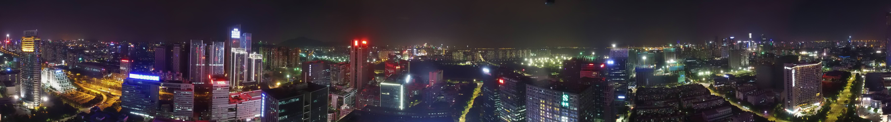

Congratulations on reaching the end of this tutorial! We covered a *lot* of material and played with many parts of the mobile SDK, including:
- Connecting to and displaying a live video feed from the drone
- Controlling the gimbal or the drone to rotate the camera
- Taking photos using the camera
- Navigating through playback modes to select and download images
- Using native code to process images
We suggest you go back and play with these individual topics on your own, maybe building an app or two yourself! Good luck, and have fun!

